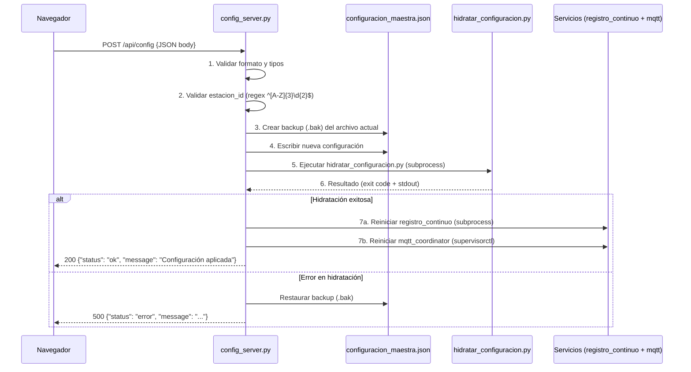

# Planificación: Fase 4 — Interfaz Web de Configuración del Acelerógrafo

> **Contexto**: Este documento detalla la implementación de la Fase 4 del [plan de unificación de configuración](file:///home/rsa/git/institucional/RSA-Bitacora-LLM-Milton/blueprints/acelerografo/planificacion_unificacion_configuracion.md#L175-L178). Se apoya en la infraestructura ya construida en las Fases 1-3 (configuración maestra, plantillas e hidratación).

---

## 🔍 1. Estado Actual del Sistema (Punto de Partida)

### Infraestructura existente (Fases 1–3 completadas)

| Componente | Ruta en Git (`PROJECT_GIT_ROOT`) | Estado |
|:---|:---|:---|
| Configuración maestra | [configuracion_maestra.json](file:///home/rsa/git/montajes/acelerografo-DEV00/configuration/configuracion_maestra.json) | ✅ Implementado |
| Plantillas `.template` | [configuration/](file:///home/rsa/git/montajes/acelerografo-DEV00/configuration/) (3 archivos) | ✅ Implementado |
| Script de hidratación | [hidratar_configuracion.py](file:///home/rsa/git/montajes/acelerografo-DEV00/scripts/setup/hidratar_configuracion.py) | ✅ Implementado |
| Integración en deploy/update | [deploy.sh](file:///home/rsa/git/montajes/acelerografo-DEV00/scripts/setup/deploy.sh), [update.sh](file:///home/rsa/git/montajes/acelerografo-DEV00/scripts/setup/update.sh) | ✅ Implementado |

### Entorno de ejecución

| Aspecto | Detalle |
|:---|:---|
| Hardware | Raspberry Pi 3B+ |
| SO | Raspbian GNU/Linux 11 (Bullseye) |
| Python | 3.x en venv (`$PROJECT_LOCAL_ROOT/.venv/`) |
| Gestión de procesos | Supervisor (para `mqtt_coordinator`) + crontab (para `registro_continuo`) |
| Variables de entorno | `PROJECT_GIT_ROOT`, `PROJECT_LOCAL_ROOT` definidas en `/etc/profile.d/project_paths.sh` |
| MQTT Broker | Externo (credenciales en `.env`) |

### Servicios que requieren reinicio tras un cambio de configuración

1. **`registro_continuo`** — Proceso C gestionado por crontab/script bash ([registrocontinuo.sh](file:///home/rsa/git/montajes/acelerografo-DEV00/scripts/task/registrocontinuo.sh)). Se controla con `registrocontinuo stop|start|restart`.
2. **`mqtt_coordinator`** — Daemon Python gestionado por Supervisor ([mqtt_coordinator.conf](file:///home/rsa/git/montajes/acelerografo-DEV00/scripts/task/mqtt_coordinator.conf)). Se controla con `supervisorctl restart mqtt_coordinator`.

---

## 🏗️ 2. Decisiones de Arquitectura

### 2.1 Elección de Framework: Flask (Lightweight)

| Criterio | Flask | FastAPI |
|:---|:---|:---|
| Compatibilidad con RPi 3B+ (ARM) | ✅ Excelente, dependencias mínimas | ⚠️ `uvicorn` + `pydantic` añaden carga |
| Dependencias adicionales | Solo `flask` | `fastapi` + `uvicorn` + `pydantic` |
| Huella de memoria | ~15-20 MB | ~40-60 MB |
| Complejidad del proyecto | Baja (API CRUD simple) | Sobredimensionado para este caso |
| Documentación automática de API | No nativa (se puede agregar) | ✅ Swagger/OpenAPI incluido |

> [!IMPORTANT]
> **Decisión**: Usar **Flask** por su mínima huella de memoria y compatibilidad nativa con el ecosistema de la Raspberry Pi. La API es pequeña (2-3 endpoints) y no justifica la complejidad de FastAPI.

### 2.2 Frontend: Página HTML estática servida por Flask

No se usará un framework de frontend (React, Vue, etc.). Se servirá una **página HTML única con JavaScript vanilla y CSS** desde el propio servidor Flask. Razones:

- Evita un proceso de build (npm/node) completamente ajeno al ecosistema actual de la RPi.
- El panel es simple: un formulario de configuración y un botón de aplicar.
- Se mantiene la coherencia con la filosofía del proyecto: sin dependencias externas innecesarias.

### 2.3 Gestión del proceso: Supervisor

El servidor web se gestionará con **Supervisor**, igual que `mqtt_coordinator`. Esto garantiza:
- Arranque automático al boot.
- Reinicio automático ante caídas.
- Logs centralizados en `$PROJECT_LOCAL_ROOT/log-files/`.

### 2.4 Seguridad de red

- El servidor Flask escuchará en **`127.0.0.1:5000`** (solo localhost) por defecto.
- El acceso remoto se realizará exclusivamente a través de un **túnel SSH** (`ssh -L 5000:127.0.0.1:5000 acelerografo-dev00`).
- No se expondrán puertos al exterior. No se implementará autenticación HTTP en esta fase inicial, ya que el acceso al servicio está protegido por la autenticación SSH del equipo.

> [!IMPORTANT]
> **Modelo de acceso futuro (WiFi AP):** En una fase posterior, se espera que la Raspberry Pi genere una **red WiFi propia con contraseña** a la que un técnico pueda conectar un teléfono móvil para realizar la configuración en campo. Cuando se implemente este escenario, el bind address deberá cambiar a `0.0.0.0` y será **obligatorio** implementar autenticación HTTP (token Bearer o Basic Auth) antes de exponer el servicio fuera de localhost.

---

## 📁 3. Estructura de Archivos Propuesta

Nuevos archivos y directorios a crear dentro del repositorio Git (`PROJECT_GIT_ROOT`):

```
scripts/
└── operation/
    └── web/                          # 🆕 Nuevo directorio
        ├── config_server.py          # Servidor Flask (API + servir frontend)
        ├── templates/
        │   └── index.html            # Interfaz web (formulario de configuración)
        └── static/
            ├── css/
            │   └── styles.css        # Estilos del panel
            └── js/
                └── app.js            # Lógica del frontend (fetch API, validaciones)

scripts/
└── task/
    └── config_server.conf            # 🆕 Configuración de Supervisor para el servidor web
```

Archivos existentes que se modificarán:

| Archivo | Cambio |
|:---|:---|
| [update.sh](file:///home/rsa/git/montajes/acelerografo-DEV00/scripts/setup/update.sh) | Agregar copia de `scripts/operation/web/` al `$PROJECT_LOCAL_ROOT` y actualización de la config de Supervisor |
| [deploy.sh](file:///home/rsa/git/montajes/acelerografo-DEV00/scripts/setup/deploy.sh) | Agregar directorio `$PROJECT_LOCAL_ROOT/scripts/web/` y configuración inicial de Supervisor |
| [requirements.txt](file:///home/rsa/git/montajes/acelerografo-DEV00/requirements.txt) | Agregar `flask` |
| [menu.sh](file:///home/rsa/git/montajes/acelerografo-DEV00/menu.sh) | (Opcional) Agregar opción para abrir/ver el estado del panel web |

---

## 🔌 4. Diseño de la API REST

### Endpoints

| Método | Ruta | Descripción |
|:---|:---|:---|
| `GET /` | Sirve `index.html` | Página principal del panel de configuración |
| `GET /api/config` | Lee y retorna `configuracion_maestra.json` | Carga la configuración actual |
| `POST /api/config` | Valida, escribe `configuracion_maestra.json`, ejecuta hidratación y reinicia servicios | Aplica cambios de configuración |
| `GET /api/status` | Retorna estado de los servicios (`registro_continuo`, `mqtt_coordinator`) | Monitoreo básico |

### `GET /api/config` — Detalle

```
Respuesta 200:
{
    "estacion_id": "DEV00",
    "nombre": "NOMBRE_COMPLETO",
    "ubicacion": "ubicacion",
    "coordenadas": { "latitud": -2.89, "longitud": -79.00, "altitud": 2500 },
    "adquisicion": { ... },
    "drive_folder_ids": { ... }
}
```

### `POST /api/config` — Flujo interno



> [!TIP]
> El backup `.bak` antes de escribir garantiza que un fallo en la hidratación no deje la estación en estado inconsistente. El sistema simplemente revierte al último estado funcional.

### `GET /api/status` — Detalle

```
Respuesta 200:
{
    "registro_continuo": { "running": true, "pid": 1234 },
    "mqtt_coordinator": { "running": true, "status": "RUNNING" },
    "ultima_hidratacion": "2026-06-04T10:30:00",
    "config_sincronizada": true
}
```

La verificación se realizará con:
- `registro_continuo`: `pgrep -f registro_continuo` (igual que [registrocontinuo.sh](file:///home/rsa/git/montajes/acelerografo-DEV00/scripts/task/registrocontinuo.sh#L10-L13))
- `mqtt_coordinator`: `supervisorctl status mqtt_coordinator`

---

## 🎨 5. Diseño del Frontend

### Concepto de interfaz

El panel web será una **Single Page Application (SPA)** minimalista pero funcional con las siguientes secciones:

1. **Encabezado**: Logo RSA, nombre de la estación (dinámico), indicadores de estado de servicios.
2. **Formulario de Configuración**: Campos agrupados por categoría (Estación, Coordenadas, Adquisición, Drive).
3. **Barra de Acciones**: Botón "Aplicar Configuración" con confirmación, indicador de estado de la operación.

### Validaciones del lado del cliente (JavaScript)

| Campo | Validación |
|:---|:---|
| `estacion_id` | Regex `^[A-Z]{3}\d{2}$` — 3 letras mayúsculas + 2 dígitos |
| `latitud` | Rango: `-90.0` a `90.0` |
| `longitud` | Rango: `-180.0` a `180.0` |
| `altitud` | Numérico, `>= 0` |
| `fuente_reloj` | `"0"` o `"1"` |
| `modo_adquisicion` | `"online"` u `"offline"` |
| `deteccion_eventos` | `"si"` o `"no"` |
| `publicar_eventos` | `"si"` o `"no"` |
| `drive_folder_ids.*` | No vacío (advertencia, no bloqueo) |

> [!NOTE]
> Las validaciones se duplican en el backend (Python) para garantizar la integridad incluso si se envían requests directos a la API sin pasar por el formulario.

---

## ⚙️ 6. Gestión de Servicios y Supervisor

### Nueva configuración de Supervisor: `config_server.conf`

```ini
[program:config_server]
command={{PROJECT_LOCAL_ROOT}}/.venv/bin/python3 {{PROJECT_LOCAL_ROOT}}/scripts/web/config_server.py
directory={{PROJECT_LOCAL_ROOT}}/scripts/web/
environment=PROJECT_LOCAL_ROOT="{{PROJECT_LOCAL_ROOT}}"
autostart=true
autorestart=true
startretries=3
user=rsa
stdout_logfile={{PROJECT_LOCAL_ROOT}}/log-files/supervisor_config_server.log
stderr_logfile={{PROJECT_LOCAL_ROOT}}/log-files/supervisor_config_server.err
```

### Reinicio seguro de servicios desde la API

El endpoint `POST /api/config` necesita reiniciar los servicios del acelerógrafo. El script [registrocontinuo.sh](file:///home/rsa/git/montajes/acelerografo-DEV00/scripts/task/registrocontinuo.sh) ya está instalado en `/usr/local/bin/registrocontinuo` y expone las opciones `stop`, `start` y `restart` que encapsulan toda la lógica necesaria (incluyendo `killall`, `reset_master`, conversión miniSEED y gestor de archivos).

**Comandos que ejecutará la API vía `subprocess`:**

| Servicio | Detener | Reiniciar |
|:---|:---|:---|
| `registro_continuo` (+ pipeline completo) | `sudo /usr/local/bin/registrocontinuo stop` | `sudo /usr/local/bin/registrocontinuo restart` |
| `mqtt_coordinator` | `sudo supervisorctl stop mqtt_coordinator` | `sudo supervisorctl restart mqtt_coordinator` |

**Permisos de sudoers necesarios**: Crear una entrada en `/etc/sudoers.d/` que permita al usuario `rsa` ejecutar únicamente estos dos comandos sin contraseña:

```
# /etc/sudoers.d/rsa-config-server
rsa ALL=(ALL) NOPASSWD: /usr/local/bin/registrocontinuo
rsa ALL=(ALL) NOPASSWD: /usr/bin/supervisorctl
```

> [!CAUTION]
> Esta configuración de sudoers debe ser revisada y aplicada manualmente por el administrador. Nunca se debe otorgar `NOPASSWD: ALL`.

---

## 🔗 7. Integración con el Flujo de Despliegue Existente

### Cambios en `deploy.sh`

```diff
 # Crear los directorios del proyecto local si no existen
+mkdir -p $PROJECT_LOCAL_ROOT/scripts/web
 
 # Copiar los scripts de Python del proyecto en Git al proyecto local
+cp -r $PROJECT_GIT_ROOT/scripts/operation/web/* $PROJECT_LOCAL_ROOT/scripts/web/
 
 # Copiar los archivos de configuracion de Supervisor
+sed "s|{{PROJECT_LOCAL_ROOT}}|$PROJECT_LOCAL_ROOT|g" $PROJECT_GIT_ROOT/scripts/task/config_server.conf > $PROJECT_LOCAL_ROOT/tmp-files/config_server.conf
+sudo cp $PROJECT_LOCAL_ROOT/tmp-files/config_server.conf /etc/supervisor/conf.d/
 
 # Actualizar Supervisor
  sudo supervisorctl reread
  sudo supervisorctl update
+sudo supervisorctl start config_server
```

### Cambios en `update.sh`

```diff
 # Revisar y actualizar archivos
+update_files_if_changed "$PROJECT_GIT_ROOT/scripts/operation/web/" "$PROJECT_LOCAL_ROOT/scripts/web/"
 
 # Función para actualizar configuración de Supervisor (existente)
 # Añadir procesamiento del nuevo archivo .conf:
+sed "s|{{PROJECT_LOCAL_ROOT}}|$PROJECT_LOCAL_ROOT|g" "$PROJECT_GIT_ROOT/scripts/task/config_server.conf" > "$temp_file_web"
+# (misma lógica de comparación y copia que mqtt_coordinator.conf)
```

### Cambios en `requirements.txt`

```diff
 # MQTT
 paho-mqtt
 python-dotenv
 
+# Panel web de configuración
+flask
```

---

## 📅 8. Cronograma de Implementación Paso a Paso

### Paso 4.1: Backend — Servidor Flask (`config_server.py`)
- Crear `scripts/operation/web/config_server.py` con:
  - Resolución de rutas vía `PROJECT_LOCAL_ROOT`.
  - Endpoint `GET /api/config`: lectura de `configuracion_maestra.json`.
  - Endpoint `POST /api/config`: validación, backup, escritura, hidratación y reinicio.
  - Endpoint `GET /api/status`: estado de servicios.
  - Servir archivos estáticos (HTML/CSS/JS) desde `templates/` y `static/`.
  - Logging con `StructuredLogger` del proyecto.
  - Bind a `127.0.0.1:5000`.

### Paso 4.2: Frontend — Interfaz HTML/CSS/JS
- Crear `templates/index.html` con formulario de configuración.
- Crear `static/css/styles.css` con estilo responsivo y oscuro.
- Crear `static/js/app.js` con lógica de carga, validación y envío.

### Paso 4.3: Configuración de Supervisor
- Crear `scripts/task/config_server.conf`.
- Crear archivo de sudoers para permisos de reinicio.

### Paso 4.4: Integración con deploy/update
- Modificar `deploy.sh` para incluir el nuevo directorio y servicio.
- Modificar `update.sh` para sincronizar archivos del servidor web.
- Agregar `flask` a `requirements.txt`.

### Paso 4.5: Documentación
- Actualizar `AGENTS.md` con la nueva sección del servidor web.
- Generar contexto técnico de `config_server.py` (skill `generar_contexto`).

---

## ⚠️ 9. Riesgos y Mitigaciones

| Riesgo | Probabilidad | Impacto | Mitigación |
|:---|:---|:---|:---|
| Flask consume demasiada RAM en RPi 3B+ | Baja | Medio | Flask es lightweight (~15MB). Monitorear con `GET /api/status`. |
| Reinicio de servicios falla desde la API | Media | Alto | Backup `.bak` + rollback automático. Logs detallados. |
| Conflicto de puertos con otros servicios | Baja | Bajo | Puerto 5000 configurable vía variable de entorno. |
| Escritura concurrente de `configuracion_maestra.json` | Baja | Alto | Usar file locking (`fcntl.flock`) en la escritura. |
| Usuario modifica JSON manualmente (bypass de la web) | Media | Bajo | El sistema tolera edición manual; la web simplemente lee lo que exista. |

---

## 🔮 10. Consideraciones Futuras (Fuera de Alcance Fase 4)

Estas funcionalidades **no** se implementarán en esta fase, pero el diseño las contempla:

- **Panel de datos instantáneos del sensor** — Replicar en la web la funcionalidad del programa C [comprobar_registro_5.0.0.c](file:///home/rsa/git/montajes/acelerografo-DEV00/scripts/operation/acelerografo/comprobar_registro_5.0.0.c) (invocado desde [comprobar.sh](file:///home/rsa/git/montajes/acelerografo-DEV00/scripts/task/comprobar.sh)). Mostraría: fuente de reloj (RPi/GPS/RTC), timestamp de la última trama, archivo de registro actual y valores de aceleración instantánea (X, Y, Z en m/s²).
- **Gráfica en tiempo real de datos muestreados** — Visualización continua tipo osciloscopio de las tres componentes de aceleración (X, Y, Z) usando datos del named pipe (`/tmp/my_pipe`) o lectura periódica de la última trama del archivo `.dat` activo. Posible implementación con WebSocket + Chart.js/Canvas.
- **Visualización de logs en tiempo real** (WebSocket/SSE desde los archivos `.log`).
- **Autenticación HTTP** — Necesaria cuando se implemente el modelo de acceso vía WiFi AP (cambio de bind a `0.0.0.0`).
- **Modo WiFi AP + configuración móvil** — La RPi generará una red WiFi propia con contraseña para que un técnico pueda configurar la estación desde un teléfono móvil en campo, sin necesidad de SSH.
