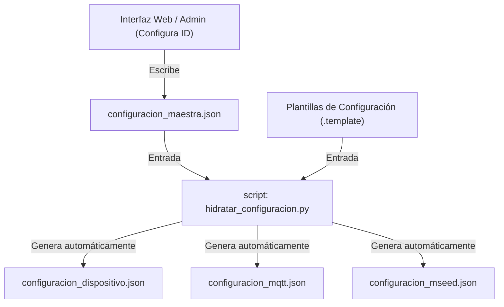

# Planificación: Unificación de la Configuración y Única Fuente de Verdad

Este documento presenta la propuesta de planificación técnica para unificar los datos de configuración de la estación acelerográfica en el directorio `montajes/acelerografo-DEV00/`. El objetivo principal es eliminar la redundancia de datos (especialmente el código de la estación, actualmente duplicado como `NOM00` en tres archivos distintos) y establecer una base sólida para una futura interfaz web de configuración.

---

## 🔍 1. Análisis de la Situación Actual

Actualmente, la configuración del sistema está fragmentada en tres archivos JSON dentro del directorio [configuration/](file:///home/rsa/git/montajes/acelerografo-DEV00/configuration/):

1. **`configuracion_dispositivo.json`**:
   - **Clave redundante**: `"dispositivo": { "id": "NOM00" }`
   - **Consumidores**:
     - C: `registro_continuo_4.5.0.c` (vía `lector_json.c`)
     - C: `comprobar_registro_5.0.0.c` (vía `lector_json.c`)
     - C: `extraer_evento_binario_2.1.1.c` (vía `lector_json.c`)
     - Python: `binary_to_mseed.py`
     - Python: `gestor_archivos_acq.py`

2. **`configuracion_mqtt.json`**:
   - **Clave redundante**: `"id": "NOM00"` (utilizado para el routing de los tópicos MQTT)
   - **Consumidores**:
     - Python: `mqtt_coordinator.py`

3. **`configuracion_mseed.json`**:
   - **Clave redundante**: `"CODIGO(1)": "NOM00"` (utilizado en las cabeceras miniSEED y para nombrar archivos)
   - **Consumidores**:
     - Python: `binary_to_mseed.py`

### El Problema
Cuando se despliega una nueva estación, se debe modificar manualmente el identificador de la estación (`NOM00`) en estos tres archivos. Este proceso es propenso a errores humanos (por ejemplo, discrepancias entre el código del broker MQTT y el del archivo miniSEED). Además, dificulta el diseño de una interfaz web, la cual tendría que modificar múltiples archivos con formatos y estructuras disímiles.

---

## 🛠️ 2. Propuestas Técnicas de Solución

Presentamos dos alternativas de diseño para lograr la unificación.

### 📋 Comparativa Rápida

| Dimensión | Alternativa A: Archivo de Configuración Único | Alternativa B: Generación por Plantillas (Recomendada) |
| :--- | :--- | :--- |
| **Complejidad de Código** | Alta (requiere reescribir parsers en C y Python) | Baja (no modifica el runtime actual) |
| **Riesgo Operativo** | Medio-Alto (requiere recompilar binarios en producción) | Muy Bajo (solo agrega una utilidad de configuración) |
| **Limpieza Arquitectural** | Excelente (un solo archivo JSON en todo el sistema) | Buena (el runtime sigue fragmentado, pero el origen es único) |
| **Aptitud para Interfaz Web** | Excelente (la Web UI edita un solo archivo) | Excelente (la Web UI edita el maestro y ejecuta regeneración) |

---

### Alternativa A: Archivo de Configuración Único (`configuracion_estacion.json`)

Consiste en fusionar los tres archivos actuales en un único archivo JSON centralizado. 

#### Estructura propuesta:
```json
{
  "estacion": {
    "id": "NOM00",
    "nombre_completo": "NOMBRE_COMPLETO",
    "red": "UC",
    "ubicacion_seed": "00",
    "latitud": -26.753,
    "longitud": -790.283,
    "altitud": 3423
  },
  "adquisicion": {
    "fuente_reloj": "0",
    "muestreo": 250,
    "modo_adquisicion": "offline",
    "deteccion_eventos": "no"
  },
  "directorios": {
    "registro_continuo": "/home/rsa/data/registro-continuo/",
    "archivos_mseed": "/home/rsa/data/mseed/",
    "eventos_extraidos": "/home/rsa/data/eventos-extraidos/",
    "archivos_temporales": "/home/rsa/projects/acelerografo/tmp-files/"
  },
  "sensor": {
    "tipo": "ACELEROGRAFICO",
    "canales": 3,
    "calidad": "D",
    "canal": "XYZ",
    "usar_fecha_filename": true
  },
  "drive": {
    "carpetas": {
      "continuos_id": "1Be03HDR...",
      "mseed_id": "....",
      "events_id": "...."
    }
  },
  "mqtt": {
    "org": "rsa",
    "app": "seismic",
    "cap": "smart"
  }
}
```

#### Cambios necesarios:
1. **C (`lector_json.c` / `lector_json.h`)**: Rediseñar el parser con `jansson` para adaptarse a la nueva estructura anidada.
2. **Binarios C (`registro_continuo`, `comprobar_registro`, `extraer_evento_binario`)**: Recompilar los programas para enlazar con la nueva biblioteca `liblector_json.so`.
3. **Scripts Python (`binary_to_mseed.py`, `gestor_archivos_acq.py`, `mqtt_coordinator.py`)**: Actualizar la lectura de las llaves en los diccionarios cargados.

---

### Alternativa B: Generación por Plantillas (Maestro + Hidratación) — *Recomendada*

Esta alternativa mantiene intacto el código de producción actual (runtime) y introduce un paso de generación automático durante la instalación o reconfiguración de la estación. 

#### Funcionamiento:


1. Se crea un archivo maestro único: **`configuracion_maestra.json`** que almacena únicamente los parámetros específicos de la estación que el usuario debe cambiar (ID, Coordenadas, carpetas de Drive).
2. Se definen plantillas base para los otros archivos (ej. `configuracion_mqtt.json.template`), donde el campo ID se representa como un marcador (`{{STATION_ID}}`).
3. Se desarrolla un script en Python **`hidratar_configuracion.py`**. Al ejecutarse, lee la configuración maestra, reemplaza las variables correspondientes en las plantillas y escribe los JSONs finales que el software de adquisición usa directamente.

#### Ventajas críticas para el entorno embebido:
- **Cero cambios en código C**: No es necesario recompilar software en producción.
- **Robustez**: Si la interfaz web falla al generar, el sistema operativo de la estación sigue utilizando la última configuración válida que se encuentra en los archivos JSON de producción.

---

## 📅 3. Cronograma de Implementación Paso a Paso (Alternativa B)

Proponemos realizar la implementación bajo la **Alternativa B** debido a su bajo riesgo operativo en estaciones activas de la RSA.

### Fase 1: Definición de Plantillas y Fuente Maestra
- **Paso 1.1**: Diseñar `configuracion_maestra.json`. Debe contener:
  ```json
  {
    "estacion_id": "NOM00",
    "nombre": "NOMBRE_COMPLETO",
    "coordenadas": {
      "latitud": -26.753,
      "longitud": -790.283,
      "altitud": 3423
    },
    "adquisicion": {
      "fuente_reloj": "0",
      "modo_adquisicion": "offline",
      "deteccion_eventos": "no",
      "publicar_eventos": "no"
    },
    "drive_folder_ids": {
      "continuos_id": "1Be03HDR...",
      "mseed_id": "....",
      "events_id": "....",
      "tmp_id": "....",
      "logs_id": "...."
    }
  }
  ```
- **Paso 1.2**: Crear los archivos de plantilla (.template):
  - `configuracion_dispositivo.json.template`
  - `configuracion_mqtt.json.template`
  - `configuracion_mseed.json.template`

### Fase 2: Desarrollo del Script de Hidratación
- **Paso 2.1**: Programar `hidratar_configuracion.py` (usando la biblioteca estándar de Python, sin dependencias externas).
- **Paso 2.2**: Agregar validación de tipos y formatos (ej. que el ID de la estación cumpla con el formato estándar de la RSA: 3 letras y 2 números, ej. `NOM00`).

### Fase 3: Integración en el Flujo de Trabajo
- **Paso 3.1**: Modificar el script de despliegue general (`deploy.sh` o similar) o el menú interactivo (`menu.sh`) para que ejecute automáticamente `hidratar_configuracion.py` antes de iniciar los servicios.
- **Paso 3.2**: Crear un hook o script de control que verifique si los archivos generados están sincronizados con la configuración maestra en cada arranque del sistema.

### Fase 4: Preparación para el Entorno Web
- **Paso 4.1**: Diseñar los endpoints de la API web de configuración (por ejemplo, en FastAPI o Flask) con las siguientes rutas:
  - `GET /api/config`: Lee `configuracion_maestra.json`.
  - `POST /api/config`: Escribe `configuracion_maestra.json`, ejecuta `hidratar_configuracion.py` y reinicia los servicios del acelerógrafo (`registro_continuo` y `mqtt_coordinator`) de manera segura para aplicar los cambios.

---

## 🛟 4. Consideraciones de Seguridad (RSA)

Conforme a las reglas del repositorio de la Red Sísmica del Austro:
1. **Restricción de Ejecución**: Toda prueba del script generador o el proceso de hidratación deberá ser coordinado con el usuario final si requiere interactuar con el hardware bajo `montajes/**`.
2. **Estructura del Repositorio**: La configuración maestra se colocará dentro del directorio de configuración existente, evitando crear directorios ad-hoc fuera de los estándares establecidos de la RSA.
