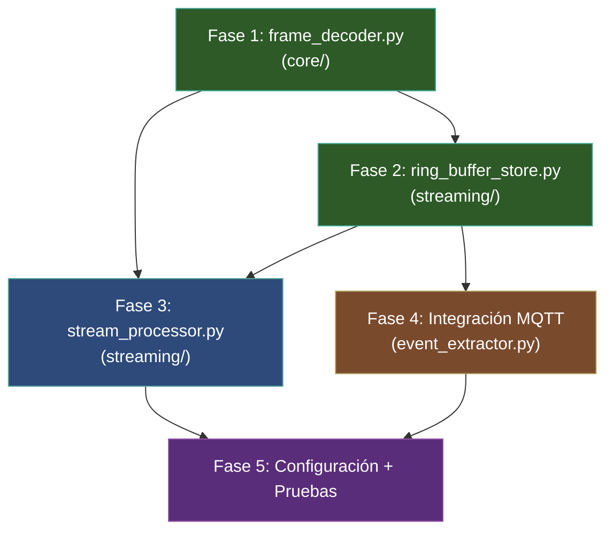
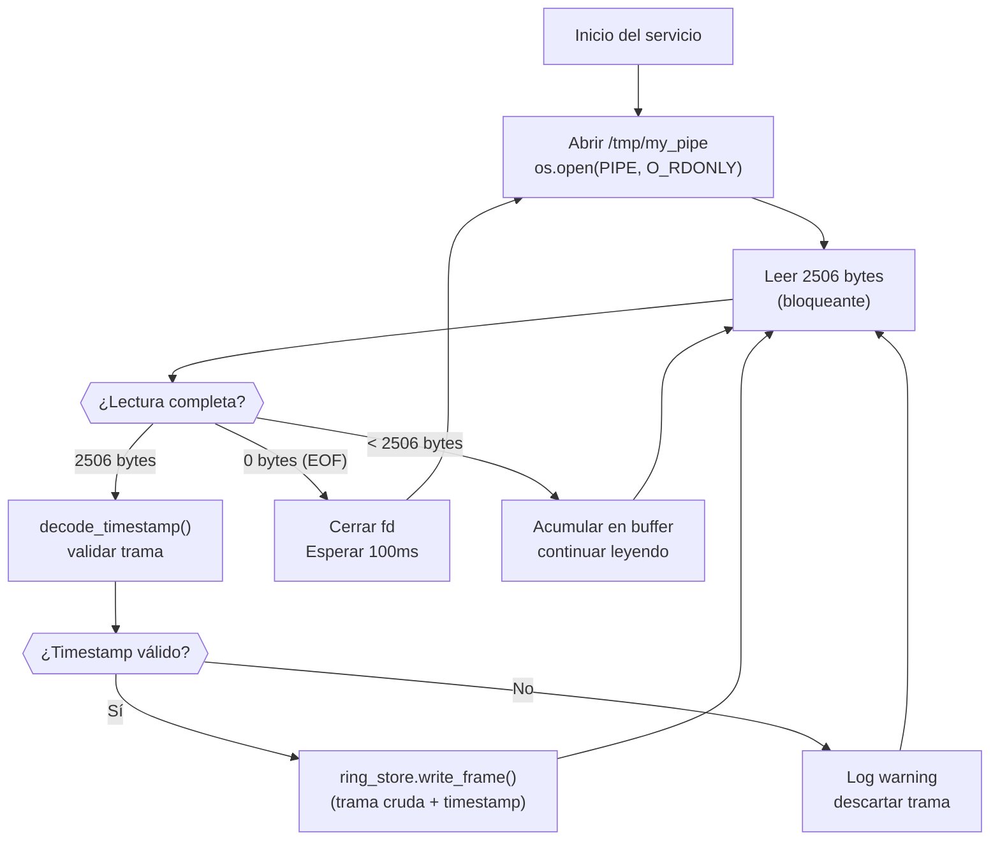
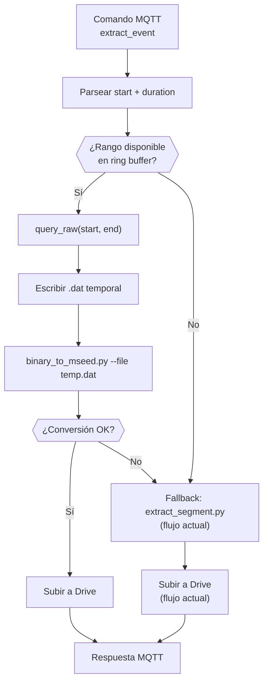

# Plan de Implementación: Ring Buffer + Extracción Bajo Demanda

> **Última revisión**: 2026-06-16 — Decisiones de diseño confirmadas por el usuario.

> Sistema de buffering continuo en disco con extracción de segmentos por comando MQTT, para el acelerógrafo de la Red Sísmica del Austro.

---

## Resumen Ejecutivo

Este plan implementa la funcionalidad **B** del blueprint general: un ring buffer en disco que almacena las tramas binarias más recientes (~11 horas) y permite la extracción de segmentos temporales bajo demanda vía MQTT, sin depender de los archivos `.mseed` horarios.

### Alcance

| Incluido | Excluido (fases futuras) |
|----------|--------------------------|
| Módulo de decodificación compartido (`frame_decoder.py`) | Inferencia GPD en tiempo real |
| Lectura del named pipe (`/tmp/my_pipe`) | Publicación a shared memory (`/dev/shm/`) |
| Ring buffer rotativo en disco | Socket Unix para consumidores streaming |
| Extracción bajo demanda vía MQTT | SeedLink feeder |
| Integración con `event_extractor.py` | Visualización local |
| Configuración y logging | Refactoring de `binary_to_mseed.py` |

> [!NOTE]
> El refactoring de `binary_to_mseed.py` para usar `frame_decoder` se pospone intencionalmente. Se hará cuando el módulo compartido esté estabilizado y probado. Esto evita riesgos sobre la funcionalidad productiva actual.

---

## Estructura de Archivos Resultante

```
scripts/operation/
├── core/                          # [NUEVO] Paquete de módulos compartidos
│   ├── __init__.py
│   └── frame_decoder.py           # Decodificación 20-bit extraída
├── streaming/                     # [NUEVO] Paquete del sistema de streaming
│   ├── __init__.py
│   ├── stream_processor.py        # Servicio daemon principal
│   └── ring_buffer_store.py       # Gestión del ring buffer en disco
├── mqtt/
│   ├── mqtt_coordinator.py        # [SIN CAMBIOS]
│   └── event_extractor.py         # [MODIFICADO] Nuevo fallback desde ring buffer
├── mseed/
│   ├── binary_to_mseed.py         # [SIN CAMBIOS en esta fase]
│   └── extract_segment.py         # [SIN CAMBIOS]
└── structured_logger.py           # [SIN CAMBIOS]

configuration/
├── configuracion_dispositivo.json.template  # [MODIFICADO] Nueva sección streaming
└── configuracion_maestra.json               # [SIN CAMBIOS]
```

---

## Diagrama de Dependencias entre Fases



---

## Fase 1: Módulo de Decodificación Compartido

> **Objetivo**: Extraer la lógica de decodificación 20-bit de `binary_to_mseed.py` en un módulo reutilizable, sin dependencia de ObsPy.

### Archivo: [core/\_\_init\_\_.py](file:///home/rsa/git/montajes/acelerografo-DEV00/scripts/operation/core/__init__.py)

```python
"""Paquete core: módulos compartidos del acelerógrafo RSA."""
```

### Archivo: [core/frame_decoder.py](file:///home/rsa/git/montajes/acelerografo-DEV00/scripts/operation/core/frame_decoder.py)

**Dependencias**: Solo `numpy`, `datetime` (stdlib). Sin ObsPy.

**API pública**:

```python
from dataclasses import dataclass
from datetime import datetime
import numpy as np

FRAME_SIZE = 2506          # Bytes por trama (1 segundo)
SAMPLES_PER_FRAME = 250    # Muestras por segundo
AXES = 3                   # X, Y, Z
SAMPLE_BLOCK_SIZE = 10     # Bytes por muestra (1 ID + 9 datos)

@dataclass
class FrameData:
    """Resultado de decodificar una trama de 2506 bytes."""
    samples: np.ndarray      # (250, 3) int32
    timestamp: datetime      # Timestamp extraído de la trama
    clock_source: int        # 0:RPi, 1:GPS, 2:RTC, 3-5:errores

def decode_frame(raw: bytes) -> FrameData:
    """
    Decodifica una trama binaria completa de 2506 bytes.
    
    Args:
        raw: Exactamente 2506 bytes crudos del named pipe o archivo .dat
        
    Returns:
        FrameData con samples (250,3) int32, timestamp y fuente de reloj
        
    Raises:
        ValueError: Si len(raw) != 2506 o timestamp inválido
    """

def decode_samples(raw: bytes) -> np.ndarray:
    """
    Decodifica solo las muestras de una trama (bytes 1-2500).
    
    Returns:
        np.ndarray de forma (250, 3) con valores int32 (20-bit C2 expandidos)
    """

def decode_timestamp(raw: bytes) -> datetime:
    """
    Extrae el timestamp de los bytes 2500-2505 de una trama.
    
    Returns:
        datetime con la fecha/hora de la trama
        
    Raises:
        ValueError: Si hora>23, minuto>59 o segundo>59
    """

def validate_timestamp(h: int, m: int, s: int) -> bool:
    """Valida que los componentes de tiempo sean coherentes."""
```

**Lógica de decodificación 20-bit** (extraída de [binary_to_mseed.py L137-150](file:///home/rsa/git/montajes/acelerografo-DEV00/scripts/operation/mseed/binary_to_mseed.py#L137-L150)):

```python
def decode_samples(raw: bytes) -> np.ndarray:
    data = np.frombuffer(raw, dtype=np.uint8)
    # Bytes 1-2500: 250 muestras × 10 bytes
    sample_data = data[1:2501].reshape((SAMPLES_PER_FRAME, SAMPLE_BLOCK_SIZE))
    
    result = np.empty((SAMPLES_PER_FRAME, AXES), dtype=np.int32)
    
    for j in range(AXES):
        d1 = sample_data[:, j * 3 + 1].astype(np.uint32)
        d2 = sample_data[:, j * 3 + 2].astype(np.uint32)
        d3 = sample_data[:, j * 3 + 3].astype(np.uint32)
        
        val = ((d1 << 12) & 0xFF000) + ((d2 << 4) & 0xFF0) + ((d3 >> 4) & 0xF)
        val = val.astype(np.int32)
        mask = val >= 0x80000
        val[mask] = -1 * ((~val[mask] + 1) & 0x7FFFF)
        
        result[:, j] = val
    
    return result
```

> [!IMPORTANT]
> **Decisión de diseño — Fecha de trama**: `frame_decoder.py` implementa **ambos métodos** de extracción de fecha, controlados por el parámetro `usar_fecha_filename`:
> - **`False` (método tradicional)**: Extrae fecha de los bytes 2500-2502 de la trama.
> - **`True` (método filename)**: Extrae la fecha del nombre del archivo `.bin` del ring buffer (formato `ring_YYYYMMDD_HHMMSS.bin`).
> 
> **Razón**: Existe un bug conocido en el firmware del dsPIC que hace que la fecha de la trama no se actualice correctamente en determinadas condiciones. Hasta corregir ese bug, el sistema productivo usa `USAR_FECHA_FILENAME=true`. El `frame_decoder` debe soportar ambos modos para ser compatible con la configuración existente de `configuracion_mseed.json`.
> 
> El `stream_processor` leerá el campo `USAR_FECHA_FILENAME` de `configuracion_mseed.json` y lo propagará al `frame_decoder`.

### Criterios de Aceptación — Fase 1

- [ ] `decode_frame()` produce salida idéntica a la decodificación en `binary_to_mseed.py` para la misma trama
- [ ] Sin dependencia de ObsPy (verificar con `import frame_decoder` sin ObsPy instalado)
- [ ] Manejo de valores negativos 20-bit (complemento a 2) correcto
- [ ] `ValueError` en timestamps inválidos (hora>23, etc.)
- [ ] Tests unitarios con tramas de ejemplo (al menos: trama normal, trama con valores negativos, trama con timestamp inválido)

---

## Fase 2: Ring Buffer Store (Almacenamiento en Disco)

> **Objetivo**: Almacenar tramas binarias crudas en disco con rotación automática FIFO y consulta por rango temporal.

### Archivo: [streaming/ring_buffer_store.py](file:///home/rsa/git/montajes/acelerografo-DEV00/scripts/operation/streaming/ring_buffer_store.py)

**Dependencias**: `numpy`, `datetime`, `os`, `glob`, `threading`, `frame_decoder` (Fase 1).

**API pública**:

```python
import threading
from datetime import datetime
from typing import List, Optional, Tuple
from core.frame_decoder import FrameData

class RingBufferStore:
    """
    Almacén de tramas binarias en disco con rotación FIFO.
    
    Organización en disco:
    - Archivos de 5 minutos (300 tramas × 2506B ≈ 752 KB)
    - Naming: ring_{YYYYMMDD}_{HHMMSS}.bin
    - Eliminación FIFO cuando se supera max_size_mb
    
    Thread-safe para escritura concurrente con consultas.
    """
    
    def __init__(
        self,
        directorio: str,
        max_size_mb: int = 500,
        archivo_duracion_s: int = 300,  # 5 minutos
        logger=None
    ):
        """
        Args:
            directorio: Ruta del directorio para archivos del ring buffer
            max_size_mb: Tamaño máximo en MB (default 500 ≈ 11 horas)
            archivo_duracion_s: Segundos por archivo antes de rotar (default 300)
            logger: Instancia de StructuredLogger (opcional)
        """
    
    def write_frame(self, raw_frame: bytes, timestamp: datetime) -> None:
        """
        Escribe una trama cruda de 2506 bytes al archivo activo.
        Rota el archivo si se alcanza archivo_duracion_s.
        Aplica política de retención si se supera max_size_mb.
        
        Args:
            raw_frame: 2506 bytes crudos (sin decodificar)
            timestamp: Timestamp de la trama (para naming y índice)
        """
    
    def query(
        self,
        start: datetime,
        end: datetime
    ) -> List[FrameData]:
        """
        Consulta tramas decodificadas en un rango temporal.
        
        Args:
            start: Inicio del rango (inclusivo)
            end: Fin del rango (inclusivo)
            
        Returns:
            Lista de FrameData ordenada cronológicamente
            
        Raises:
            ValueError: Si start > end
        """
    
    def query_raw(
        self,
        start: datetime,
        end: datetime
    ) -> List[bytes]:
        """
        Consulta tramas crudas (sin decodificar) en un rango temporal.
        Útil para reconversión a miniSEED.
        
        Returns:
            Lista de bloques de 2506 bytes
        """
    
    def get_time_range(self) -> Optional[Tuple[datetime, datetime]]:
        """
        Retorna el rango temporal disponible en el ring buffer.
        
        Returns:
            (oldest_timestamp, newest_timestamp) o None si está vacío
        """
    
    def get_disk_usage_mb(self) -> float:
        """Retorna el espacio en disco usado por el ring buffer en MB."""
    
    def _rotate_file(self) -> None:
        """Cierra el archivo activo y abre uno nuevo."""
    
    def _enforce_retention(self) -> None:
        """Elimina archivos más antiguos si se supera max_size_mb (FIFO)."""
    
    def _rebuild_index(self) -> None:
        """
        Reconstruye el índice en memoria al iniciar, escaneando
        archivos existentes en el directorio.
        """
    
    def close(self) -> None:
        """Cierra el archivo activo de forma limpia (para shutdown)."""
```

### Estructura del Índice en Memoria

```python
# Cada entrada del índice:
@dataclass
class RingFileEntry:
    filepath: str          # Ruta completa del archivo .bin
    start_time: datetime   # Timestamp de la primera trama
    end_time: datetime     # Timestamp de la última trama
    frame_count: int       # Número de tramas en el archivo
    size_bytes: int        # Tamaño del archivo

# Índice: lista ordenada por start_time
self._index: List[RingFileEntry] = []
self._lock: threading.Lock = threading.Lock()
```

### Formato de Archivo en Disco

Cada archivo `.bin` es una concatenación directa de tramas crudas:

```
[trama_0 (2506B)][trama_1 (2506B)]...[trama_N (2506B)]
```

> [!NOTE]
> **Sin header adicional**. El timestamp se extrae de los bytes 2500-2505 de cada trama. Esto permite que los archivos del ring buffer sean compatibles con `binary_to_mseed.py` para reconversión si es necesario.

### Política de Retención

```
Flujo de _enforce_retention():
1. Calcular tamaño total del directorio (sum de todos los .bin)
2. Mientras tamaño_total > max_size_mb * 1024 * 1024:
   a. Tomar el archivo más antiguo del índice (índice[0])
   b. os.remove(archivo)
   c. Remover del índice
   d. Recalcular tamaño_total
3. Log: cantidad de archivos eliminados
```

### Criterios de Aceptación — Fase 2

- [ ] Archivos rotan cada 300 segundos (configurable)
- [ ] Eliminación FIFO cuando se supera `max_size_mb`
- [ ] `query()` retorna tramas correctas para un rango dentro del buffer
- [ ] `query()` retorna lista vacía si el rango está fuera del buffer (no lanza excepción)
- [ ] `query_raw()` retorna bytes compatibles con `binary_to_mseed.py`
- [ ] Thread-safe: escritura concurrente con consultas no produce corrupción
- [ ] `_rebuild_index()` reconstruye correctamente tras reinicio del servicio
- [ ] Naming de archivos: `ring_YYYYMMDD_HHMMSS.bin`
- [ ] Log de rotaciones y eliminaciones vía `StructuredLogger`

---

## Fase 3: Stream Processor (Servicio Daemon)

> **Objetivo**: Servicio que lee continuamente del named pipe, decodifica tramas y las persiste en el ring buffer.

### Archivo: [streaming/stream_processor.py](file:///home/rsa/git/montajes/acelerografo-DEV00/scripts/operation/streaming/stream_processor.py)

**Dependencias**: `frame_decoder` (Fase 1), `RingBufferStore` (Fase 2), `StructuredLogger`, `json`, `os`, `signal`, `sys`, `time`.

**Diseño del servicio**:

```python
class StreamProcessor:
    """
    Servicio daemon que lee tramas del named pipe y las persiste
    en el ring buffer en disco.
    
    Diseñado para correr como servicio Supervisor junto a
    registro_continuo, binary_to_mseed y mqtt_coordinator.
    """
    
    def __init__(self, config: dict, logger):
        """
        Args:
            config: Sección 'streaming' de configuracion_dispositivo.json
            logger: Instancia de StructuredLogger
        """
        self.pipe_path = "/tmp/my_pipe"
        self.ring_store = RingBufferStore(
            directorio=config["ring_buffer"]["directorio"],
            max_size_mb=config["ring_buffer"]["max_size_mb"],
            archivo_duracion_s=config["ring_buffer"]["archivo_duracion_min"] * 60,
            logger=logger
        )
        self._running = False
    
    def start(self) -> None:
        """
        Bucle principal:
        1. Abrir named pipe en modo lectura bloqueante
        2. Leer exactamente 2506 bytes
        3. Decodificar timestamp para validación
        4. Escribir trama cruda al ring buffer
        5. Repetir
        
        Manejo del pipe (adaptado al comportamiento de registro_continuo):
        - registro_continuo abre/escribe/cierra el pipe en cada trama
        - Este lado debe re-abrir el pipe cuando el escritor lo cierra (EOF)
        - Al recibir EOF: cerrar fd y re-abrir (bucle exterior)
        """
    
    def stop(self) -> None:
        """Señal de parada limpia (SIGTERM/SIGINT)."""
    
    def _read_pipe_loop(self, fd: int) -> None:
        """
        Lee tramas de 2506 bytes del file descriptor.
        Retorna al recibir EOF (el escritor cerró el pipe).
        """
    
    def _handle_incomplete_read(self, buffer: bytes) -> None:
        """
        Manejo de lecturas parciales:
        - Si len(buffer) < 2506: acumular hasta completar
        - Si len(buffer) == 0: EOF
        """
```

### Flujo del Bucle Principal



> [!WARNING]
> **Comportamiento del named pipe**: Según [registro_continuo_context.md](file:///home/rsa/git/montajes/acelerografo-DEV00/docs/context/registro_continuo_context.md), `registro_continuo_4.5.0.c` abre y cierra el pipe en cada escritura (`open(O_NONBLOCK) + write + close`). Esto significa que el lector recibirá EOF después de cada trama. El `stream_processor` debe:
> 1. Abrir el pipe con `O_RDONLY` (bloqueante, sin `O_NONBLOCK`)
> 2. Leer hasta EOF
> 3. Re-abrir el pipe inmediatamente
> 
> **Alternativa más robusta**: Abrir el pipe también con `O_RDWR` para evitar que cierre al no tener escritor. Esto es un truco estándar en Linux para mantener el fd abierto.

### Señales del Proceso

| Señal | Handler | Acción |
|-------|---------|--------|
| `SIGTERM` | `stop()` | Cierre limpio: `_running = False`, `ring_store.close()` |
| `SIGINT` | `stop()` | Igual que SIGTERM |
| `SIGPIPE` | `signal.SIG_IGN` | Ignorar (por consistencia con registro_continuo) |

### Punto de Entrada (`main`)

```python
def main():
    # 1. Leer $PROJECT_LOCAL_ROOT
    # 2. Cargar configuracion_dispositivo.json
    # 3. Extraer sección "streaming"
    # 4. Validar que streaming.habilitado == true
    # 5. Inicializar StructuredLogger (archivo: stream_processor.log)
    # 6. Registrar manejadores de señal
    # 7. Crear StreamProcessor(config, logger)
    # 8. processor.start()  ← bucle infinito
```

### Criterios de Aceptación — Fase 3

- [ ] Lee tramas del named pipe sin perder datos
- [ ] Tolera el patrón open/write/close de `registro_continuo`
- [ ] Cada trama leída se persiste en el ring buffer
- [ ] Cierre limpio con SIGTERM (sin corrupción de archivos)
- [ ] Re-apertura automática del pipe tras EOF
- [ ] Tramas con timestamp inválido se descartan con log warning
- [ ] Logging al arranque: versión, config, rango existente del ring buffer
- [ ] No falla si `/tmp/my_pipe` no existe todavía (espera a que `registro_continuo` lo cree)

---

## Fase 4: Integración con Extracción MQTT

> **Objetivo**: Modificar el flujo de extracción de eventos para que intente primero extraer desde el ring buffer antes de recurrir a los archivos `.mseed` horarios.

### Archivo modificado: [event_extractor.py](file:///home/rsa/git/montajes/acelerografo-DEV00/scripts/operation/mqtt/event_extractor.py)

**Cambios**:

```diff
 def extraer_y_subir_evento(
     start: str,
     duration: float,
     upload: bool = True,
     delete_after_upload: bool = False,
     logger=None
 ) -> dict:
+    # ------------------------------------------------------------------
+    # Fase 0: Intentar extracción desde ring buffer (más rápida)
+    # ------------------------------------------------------------------
+    ring_result = _intentar_extraer_desde_ring_buffer(start, duration, logger)
+    if ring_result is not None:
+        # ring_result contiene la ruta del .mseed generado
+        output_file = os.path.basename(ring_result)
+        _log("info", f"[EVENT_EXTRACTOR] Extracción desde ring buffer exitosa → {output_file}")
+        # Continuar con la subida a Drive (reutilizar lógica existente)
+        ...
+        return resultado
+
     # ------------------------------------------------------------------
     # Fase 1: Extracción desde archivos .mseed (flujo existente)
     # ------------------------------------------------------------------
     ...
```

### Nueva función interna:

```python
def _intentar_extraer_desde_ring_buffer(
    start_str: str,
    duration: float,
    logger
) -> Optional[str]:
    """
    Intenta extraer un segmento desde el ring buffer en disco.
    
    Flujo:
    1. Parsear start_str a datetime
    2. Calcular end = start + duration
    3. Verificar si el rango está dentro del ring buffer
    4. Consultar tramas crudas con ring_store.query_raw()
    5. Escribir tramas a archivo temporal .dat
    6. Invocar binary_to_mseed.py modo 3 sobre ese archivo temporal
    7. Retornar ruta del .mseed generado, o None si falla
    
    Returns:
        Ruta del archivo .mseed generado, o None si el rango
        no está disponible en el ring buffer.
    """
```

### Flujo de Extracción Dual



> [!IMPORTANT]
> **Decisión de diseño**: La interacción entre `event_extractor.py` (proceso MQTT) y `ring_buffer_store.py` (proceso stream_processor) se resuelve así:
> - `event_extractor.py` instancia su propio `RingBufferStore` en **modo solo lectura** (no escribe, solo consulta).
> - Ambos procesos acceden al mismo directorio de archivos `.bin`.
> - El `threading.Lock` del `RingBufferStore` protege las operaciones dentro de cada proceso.
> - La atomicidad a nivel de archivos la garantiza el SO (lectura de archivos ya cerrados por el escritor no tiene race condition).
> - Solo hay riesgo con el archivo **activamente en escritura** — la consulta debe excluir el archivo más reciente si su escritura está en curso, o bien leer solo tramas completas (múltiplos de 2506 bytes).

### Criterios de Aceptación — Fase 4

- [ ] Si el rango temporal cae dentro del ring buffer → extrae desde él (sin invocar `extract_segment.py`)
- [ ] Si el rango cae fuera del ring buffer → fallback transparente al flujo actual
- [ ] El archivo `.mseed` generado desde el ring buffer es idéntico en formato al generado por `extract_segment.py`
- [ ] La respuesta MQTT incluye campo `"source": "ring_buffer"` o `"source": "mseed_archive"` para trazabilidad
- [ ] Sin impacto en el rendimiento del `stream_processor` durante consultas concurrentes
- [ ] Limpieza de archivos `.dat` temporales tras conversión exitosa

---

## Fase 5: Configuración y Pruebas

### Modificación: [configuracion_dispositivo.json.template](file:///home/rsa/git/montajes/acelerografo-DEV00/configuration/configuracion_dispositivo.json.template)

Agregar sección `streaming` al template:

```diff
     "gestion_almacenamiento": {
         ...
-    }
+    },
+    "streaming": {
+        "habilitado": true,
+        "ring_buffer": {
+            "directorio": "/home/rsa/data/ring-buffer/",
+            "max_size_mb": 500,
+            "archivo_duracion_min": 5
+        }
+    }
 }
```

> [!NOTE]
> Se usa la convención de rutas del template existente: `/home/rsa/data/` como base. El directorio `ring-buffer/` se creará automáticamente por `RingBufferStore.__init__()` si no existe.

### Logging — Nuevos métodos para `StructuredLogger`

Se agregarán métodos específicos para el streaming:

```python
# En structured_logger.py:

def ring_write(self, filename: str, frame_count: int):
    """[RING_WRITE] Trama escrita al ring buffer"""
    self._log_structured("DEBUG", "RING_WRITE", filename, {"frames": frame_count})

def ring_rotate(self, old_file: str, new_file: str):
    """[RING_ROTATE] Rotación de archivo del ring buffer"""
    self._log_structured("INFO", "RING_ROTATE", old_file, {"new": new_file})

def ring_cleanup(self, deleted_count: int, freed_mb: float):
    """[RING_CLEANUP] Limpieza por política de retención"""
    self._log_structured("SUMMARY", "RING_CLEANUP", None, {"deleted": deleted_count, "freed_mb": f"{freed_mb:.1f}"})

def ring_query(self, start: str, end: str, frames_found: int):
    """[RING_QUERY] Consulta al ring buffer"""
    self._log_structured("INFO", "RING_QUERY", None, {"start": start, "end": end, "frames": frames_found})

def pipe_read(self, status: str, details: str = None):
    """[PIPE_READ] Estado de lectura del named pipe"""
    self._log_structured("DEBUG", "PIPE_READ", None, {"status": status, "details": details})

def pipe_error(self, error: str):
    """[PIPE_ERROR] Error en lectura del named pipe"""
    self._log_structured("SUMMARY", "PIPE_ERROR", None, {"error": error})
```

### Pruebas

#### Tests Unitarios (ejecutables sin hardware)

| Test | Módulo | Descripción |
|------|--------|-------------|
| `test_decode_normal` | `frame_decoder` | Trama con valores positivos conocidos |
| `test_decode_negative` | `frame_decoder` | Valores negativos 20-bit C2 |
| `test_decode_invalid_timestamp` | `frame_decoder` | hora=25 → ValueError |
| `test_decode_clock_sources` | `frame_decoder` | Byte 0 = 0,1,2,3,4,5 |
| `test_ring_write_and_query` | `ring_buffer_store` | Escribir N tramas, consultar rango |
| `test_ring_rotation` | `ring_buffer_store` | Verificar rotación tras N segundos |
| `test_ring_retention` | `ring_buffer_store` | Verificar eliminación FIFO |
| `test_ring_empty_query` | `ring_buffer_store` | Consulta fuera de rango → lista vacía |
| `test_ring_rebuild_index` | `ring_buffer_store` | Reconstruir tras "reinicio" |
| `test_extraction_from_ring` | `event_extractor` | Extracción exitosa desde ring buffer |
| `test_extraction_fallback` | `event_extractor` | Rango fuera de buffer → fallback |

#### Verificación en Hardware (manual, en la RPi con delegación al usuario)

> [!CAUTION]
> Recordar la **restricción SSHFS**: no ejecutar comandos autónomos en rutas bajo `montajes/**`. Los comandos de verificación se proporcionarán al usuario para ejecución manual.

| Verificación | Comando sugerido |
|-------------|-----------------|
| Lectura del pipe | `python3 stream_processor.py` (observar logs) |
| Rotación de archivos | `ls -la /home/rsa/data/ring-buffer/` cada 5 min |
| Extracción desde ring buffer | Publicar `extract_event` vía MQTT y verificar respuesta |
| Consumo de recursos | `top -p $(pgrep -f stream_processor)` |

---

## Estimación de Esfuerzo

| Fase | Componente | Estimación |
|------|-----------|------------|
| 1 | `frame_decoder.py` + tests | ~1 sesión |
| 2 | `ring_buffer_store.py` + tests | ~1-2 sesiones |
| 3 | `stream_processor.py` | ~1 sesión |
| 4 | Integración `event_extractor.py` | ~1 sesión |
| 5 | Configuración + logger + pruebas finales | ~1 sesión |
| **Total** | | **~5-6 sesiones** |

---

## Decisiones Pendientes

> ~~**1. Directorio del ring buffer en el dispositivo DEV00**~~ ✅ **RESUELTO**
> 
> Ruta confirmada: **`/home/rsa/data/ring-buffer/`**

> ~~**2. Interacción con el pipe: `O_RDONLY` vs `O_RDWR`**~~ ✅ **RESUELTO**
> 
> Opción confirmada: **B) `O_RDWR`** — Mantiene el fd abierto permanentemente, evitando el ciclo open/EOF/close por trama.

> ~~**3. ¿Agregar campo `source` a la respuesta de `extract_event`?**~~ ✅ **RESUELTO**
> 
> Confirmado: se incluirá el campo **`"source"`** con valores `"ring_buffer"` o `"mseed_archive"` en la respuesta de `extract_event`.
