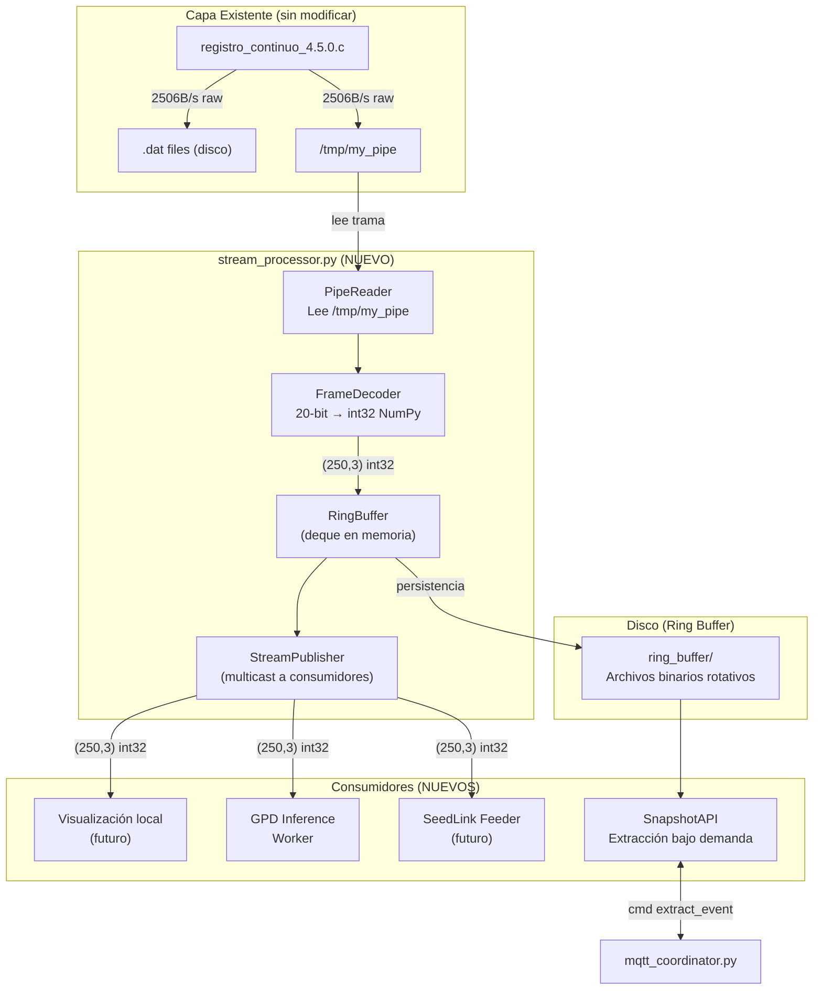

# Sistema de Streaming en Tiempo Real y Búfer Circular

## Contexto del Problema

El sistema actual del acelerógrafo RSA tiene las siguientes limitaciones:

1. **Sin consumidores de streaming**: El named pipe `/tmp/my_pipe` ya transmite tramas binarias de 2506 bytes por segundo, pero **ningún proceso las consume**.
2. **Extracción de eventos solo manual**: El `extract_segment.py` recorta archivos `.mseed` ya escritos en disco, lo que impide reaccionar en tiempo real.
3. **Sin buffer continuo**: No existe un mecanismo para extraer los *N segundos antes y después* de un evento detectado automáticamente.
4. **Sin inferencia ML en línea**: El modelo GPD existe pero solo opera sobre archivos miniSEED estáticos, no sobre datos en tiempo real.

### Hallazgos Clave de la Investigación

| Aspecto | Hallazgo |
|---------|----------|
| **Named pipe** | `registro_continuo_4.5.0.c` ya escribe tramas raw de 2506B a `/tmp/my_pipe` con `O_NONBLOCK` — drops silenciosos si no hay lector |
| **Formato binario** | Bien definido: 1B fuente_reloj + 250×10B muestras (20-bit C2 por eje) + 6B timestamp |
| **Modelo GPD** | Necesita input `(400, 3)` float32 @ 100Hz = ventana de 4 segundos; solo usa NumPy para inferencia, miniSEED es solo el contenedor de I/O |
| **Decodificación 20-bit** | Ya existe en [binary_to_mseed.py](file:///c:/Users/miltonrsa/Documents/git/rsa/RSA-Acelerografo/scripts/operation/mseed/binary_to_mseed.py) y puede extraerse como módulo compartido |
| **Resampling** | GPD opera a 100Hz; datos raw a 250Hz → requiere downsampling 2.5:1 (con `scipy.signal.resample`) |
| **Supervisor** | Ya gestiona 3 servicios; un 4º (stream_processor) encaja naturalmente |

---

## Decisión Arquitectónica: Formato Binario vs miniSEED para Streaming

> [!IMPORTANT]
> **Recomendación: Usar formato binario crudo para el streaming interno, NO miniSEED por segundo.**

### Justificación

| Criterio | miniSEED por segundo | Binario crudo |
|----------|---------------------|---------------|
| **Overhead** | Alto: headers SEED (48B fijos + blockettes), encoding STEIM1, ObsPy en cada trama | Cero: datos ya disponibles del pipe |
| **Latencia** | ~10-50ms adicionales por encoding STEIM1 + I/O ObsPy | < 1ms para decodificar 20-bit a int32 |
| **CPU (RPi 3B+)** | ObsPy consume ~2-5% CPU por conversión | Decodificación NumPy pura: < 0.1% |
| **Compatibilidad SeedLink** | Directa | Requiere conversión en el punto de envío (una sola vez, no en cada consumidor) |
| **Compatibilidad GPD** | Requiere `obspy.read()` + extracción a NumPy | Directa a NumPy (lo que GPD realmente necesita) |
| **Visualización local** | Sobra — solo se necesitan arrays numéricos | Directa |

**Conclusión**: El formato binario interno es más eficiente para todos los consumidores. La conversión a miniSEED solo debe ocurrir en el punto de salida hacia SeedLink/SeisComP, no en el streaming interno.

---

## Arquitectura Propuesta



---

## Propuesta de Cambios

### Componente 1: Módulo de Decodificación Compartido

> Extraer la lógica de decodificación 20-bit de `binary_to_mseed.py` en un módulo reutilizable.

#### [NEW] [frame_decoder.py](file:///c:/Users/miltonrsa/Documents/git/rsa/RSA-Acelerografo/scripts/operation/core/frame_decoder.py)

Módulo ligero (sin dependencia de ObsPy) que:
- Decodifica una trama binaria de 2506 bytes → `(250, 3)` array NumPy int32
- Extrae el timestamp (6 bytes finales) → `datetime`
- Extrae la fuente de reloj (byte 0) → `int`
- Valida la coherencia de la trama (hora/min/seg válidos)
- Se reutiliza desde: `stream_processor.py`, `binary_to_mseed.py` (refactored), y los scripts GPD adaptados

```python
# API pública:
def decode_frame(raw: bytes) -> FrameData  # NamedTuple(samples, timestamp, clock_source)
def decode_samples(raw: bytes) -> np.ndarray  # (250, 3) int32
def decode_timestamp(raw: bytes) -> datetime
def validate_timestamp(h, m, s) -> bool
```

#### [NEW] [\_\_init\_\_.py](file:///c:/Users/miltonrsa/Documents/git/rsa/RSA-Acelerografo/scripts/operation/core/__init__.py)

Paquete `core` para módulos compartidos.

---

### Componente 2: Stream Processor (Servicio Principal)

> Servicio daemon que lee el named pipe, decodifica tramas, mantiene un ring buffer en memoria y en disco, y distribuye datos a consumidores.

#### [NEW] [stream_processor.py](file:///c:/Users/miltonrsa/Documents/git/rsa/RSA-Acelerografo/scripts/operation/streaming/stream_processor.py)

**Responsabilidades**:
1. **PipeReader**: Lee tramas de 2506 bytes de `/tmp/my_pipe` de forma continua
2. **Decodificación**: Usa `frame_decoder.decode_frame()` para obtener `(250, 3)` int32 + timestamp
3. **Ring Buffer en memoria**: `collections.deque(maxlen=N)` con los últimos N segundos decodificados (configurable, default: 3600s = 1 hora)
4. **Persistencia en disco**: Escribe tramas binarias a archivos rotativos en un directorio `ring_buffer/` con política de borrado por tamaño total
5. **Publicación multicast**: Expone datos via un socket Unix datagram o un segundo named pipe para consumidores downstream

**Diseño del Ring Buffer en disco**:
- Archivos de 5 minutos (300 tramas × 2506B = ~752KB por archivo)
- Rotación automática cada 5 minutos
- Eliminación FIFO cuando el directorio excede `max_ring_size_mb` (configurable, default: 500MB ≈ ~11 horas)
- Naming: `ring_{YYYYMMDD}_{HHMMSS}.bin`
- Índice en memoria: lista ordenada de archivos con rangos temporales para búsqueda rápida

**Publicación a consumidores** — Dos mecanismos complementarios:
1. **Archivo mmap compartido** (`/dev/shm/rsa_current_frame`): Para consumidores locales de ultra-baja latencia (visualización, GPD). Escribe la trama decodificada más reciente + un contador de secuencia.
2. **Unix Domain Socket** (streaming): Para consumidores que necesitan el flujo continuo (futuro SeedLink feeder).

#### [NEW] [ring_buffer_store.py](file:///c:/Users/miltonrsa/Documents/git/rsa/RSA-Acelerografo/scripts/operation/streaming/ring_buffer_store.py)

Clase `RingBufferStore` responsable de:
- Escritura rotativa de tramas binarias a disco
- Consulta por rango temporal: `query(start: datetime, end: datetime) → list[FrameData]`
- Política de retención por tamaño (FIFO)
- Thread-safe para consultas concurrentes desde el snapshot API

#### [NEW] [stream_publisher.py](file:///c:/Users/miltonrsa/Documents/git/rsa/RSA-Acelerografo/scripts/operation/streaming/stream_publisher.py)

Clase `StreamPublisher` responsable de:
- Publicar cada trama decodificada a `/dev/shm/rsa_current_frame` (shared memory)
- Mantener un socket Unix para consumidores de streaming
- Gestionar conexiones/desconexiones de consumidores sin afectar el flujo principal

---

### Componente 3: Worker de Inferencia GPD

> Consumidor del stream que acumula ventanas de 4 segundos y ejecuta inferencia ML en tiempo real.

#### [NEW] [gpd_stream_worker.py](file:///c:/Users/miltonrsa/Documents/git/rsa/RSA-Acelerografo/scripts/operation/streaming/gpd_stream_worker.py)

**Pipeline de inferencia en streaming**:
1. Lee tramas decodificadas desde shared memory (polling cada ~100ms sobre el contador de secuencia)
2. Acumula en buffer circular de 4 segundos (1000 muestras @ 250Hz)
3. Resamplea 250Hz → 100Hz usando `scipy.signal.resample` → 400 muestras
4. Normaliza per-window (zero mean, unit variance)
5. Aplica filtro pasabanda 1-45Hz (si configurado)
6. Ejecuta inferencia TFLite: input `(1, 400, 3)` → output `[noise, P, S]`
7. Si P > umbral o S > umbral → publica detección vía MQTT en tópico `events/detected`
8. Stride de 1 segundo (avanza 250 muestras, reutiliza 750 del buffer)

**Integración con sistema de extracción existente**:
- Cuando GPD detecta un evento, publica un mensaje MQTT con el timestamp
- `mqtt_coordinator.py` puede usar el ring buffer en disco para extraer el segmento completo (pre + post evento) sin depender de los archivos `.mseed` horarios

---

### Componente 4: API de Snapshot (Consulta al Ring Buffer)

#### [MODIFY] [event_extractor.py](file:///c:/Users/miltonrsa/Documents/git/rsa/RSA-Acelerografo/scripts/operation/mqtt/event_extractor.py)

Agregar lógica para consultar primero el ring buffer en disco antes de buscar en archivos `.mseed`:

```python
def extraer_evento(start_time_str, duration, config, logger):
    # 1. NUEVO: Intentar extraer desde ring buffer (más rápido, datos más recientes)
    ring_result = intentar_extraer_desde_ring_buffer(start_time_str, duration, config)
    if ring_result.success:
        # Convertir a miniSEED y subir
        ...
        return ring_result
    
    # 2. FALLBACK: Extraer desde archivos .mseed existentes (comportamiento actual)
    return extraer_desde_mseed(start_time_str, duration, config, logger)
```

---

### Componente 5: Refactoring del Decodificador en binary_to_mseed.py

#### [MODIFY] [binary_to_mseed.py](file:///c:/Users/miltonrsa/Documents/git/rsa/RSA-Acelerografo/scripts/operation/mseed/binary_to_mseed.py)

Refactorizar la función `leer_archivo_binario()` para usar `frame_decoder.decode_samples()` del módulo compartido, eliminando la duplicación de la lógica de decodificación 20-bit. La interfaz pública no cambia.

---

### Componente 6: Configuración

#### [MODIFY] [configuracion_dispositivo.json](file:///c:/Users/miltonrsa/Documents/git/rsa/RSA-Acelerografo/configuration/configuracion_dispositivo.json)

Agregar sección de configuración del streaming:

```json
{
    "streaming": {
        "habilitado": true,
        "ring_buffer": {
            "directorio": "/home/rsa/projects/acelerografo/datos/RING/",
            "max_size_mb": 500,
            "archivo_duracion_min": 5
        },
        "shared_memory": {
            "ruta": "/dev/shm/rsa_current_frame",
            "tamaño_bytes": 8192
        },
        "gpd": {
            "habilitado": true,
            "modelo_ruta": "models/tflite/gpd_model.tflite",
            "ventana_pre_evento_s": 60,
            "ventana_post_evento_s": 60
        }
    },
    "directorios": {
        "ring_buffer": "/home/rsa/projects/acelerografo/datos/RING/"
    }
}
```

#### [MODIFY] [acelerografo.conf](file:///c:/Users/miltonrsa/Documents/git/rsa/RSA-Acelerografo/configuration/supervisor/acelerografo.conf)

Agregar los nuevos servicios al Supervisor:

```ini
[program:stream_processor]
command=/home/rsa/projects/acelerografo/.venv/bin/python3
    /home/rsa/projects/acelerografo/scripts/operation/streaming/stream_processor.py
autostart=true
autorestart=true
user=rsa
priority=150
depends_on=registro_continuo

[program:gpd_worker]
command=/home/rsa/projects/acelerografo/.venv/bin/python3
    /home/rsa/projects/acelerografo/scripts/operation/streaming/gpd_stream_worker.py
autostart=true
autorestart=true
user=rsa
priority=250
depends_on=stream_processor
```

---

## User Review Required

> [!IMPORTANT]
> **Decisión: Mecanismo de comunicación inter-procesos (IPC)**
> 
> Propongo usar **shared memory (`/dev/shm/`)** para la comunicación stream_processor → gpd_worker porque es el mecanismo de menor latencia en Linux. La alternativa sería un **segundo named pipe** o **sockets Unix**, que son más simples pero con más overhead.
> 
> ¿Estás de acuerdo con shared memory, o prefieres un mecanismo más simple inicialmente?

> [!IMPORTANT]
> **Decisión: Ventana de retención del ring buffer en disco**
> 
> Propongo **500MB** (~11 horas a 2506 bytes/s). Esto permite extraer eventos de las últimas ~11 horas sin depender de archivos `.mseed`. ¿Es suficiente, o necesitas más/menos retención?

> [!WARNING]
> **Sobre los scripts GPD existentes**: Ambos scripts ([gpd_tflite_inference_chunked.py](file:///c:/Users/miltonrsa/Documents/git/institucional/generalized-phase-detection/scripts/inference/chunked/gpd_tflite_inference_chunked.py) y [gpd_keras_inference_events.py](file:///c:/Users/miltonrsa/Documents/git/institucional/generalized-phase-detection/scripts/inference/gpd_keras_inference_events.py)) **SÍ se pueden adaptar** para trabajar con datos binarios. El modelo internamente solo consume arrays NumPy `(400, 3)` float32. miniSEED es solo el contenedor de I/O que se puede reemplazar. Sin embargo, propongo **no modificar esos scripts** sino crear un nuevo `gpd_stream_worker.py` optimizado para streaming, y dejar los existentes para análisis batch/offline.

---

## Open Questions

> [!IMPORTANT]
> **1. ¿Qué prioridad tienen las 3 funcionalidades?**
> - A) Inferencia GPD en tiempo real
> - B) Ring buffer + extracción bajo demanda
> - C) SeedLink feeder
> 
> Esto determina el orden de implementación. Mi recomendación: B → A → C, porque el ring buffer es prerequisito para la extracción post-detección del GPD.

> [!IMPORTANT]  
> **2. ¿Debo crear un contexto de documentación (`streaming_context.md`) para el nuevo sistema de streaming, siguiendo el mismo patrón de los docs existentes?**

> [!NOTE]
> **3. Sobre el named pipe actual**: `registro_continuo_4.5.0.c` abre y cierra el pipe en cada escritura (`open(O_NONBLOCK)` + `write` + `close`). Esto funciona para un solo lector pero es subóptimo. ¿Estás dispuesto a modificar el código C para mantener el file descriptor abierto, o prefieres que el `stream_processor.py` se adapte al comportamiento actual?

---

## Verificación

### Pruebas Automatizadas
- Tests unitarios para `frame_decoder.py` con tramas binarias de ejemplo (incluyendo edge cases: valores negativos 20-bit, timestamps en cruce de medianoche)
- Tests de integración para `RingBufferStore` (escritura, consulta por rango, política de retención)
- Test de inferencia GPD con datos sintéticos para validar el pipeline completo

### Verificación Manual
- Desplegar `stream_processor.py` en la RPi y verificar que lee correctamente del pipe sin perder tramas
- Confirmar que el ring buffer rota archivos correctamente bajo presión de espacio
- Validar la latencia end-to-end: trama SPI → detección GPD → publicación MQTT
