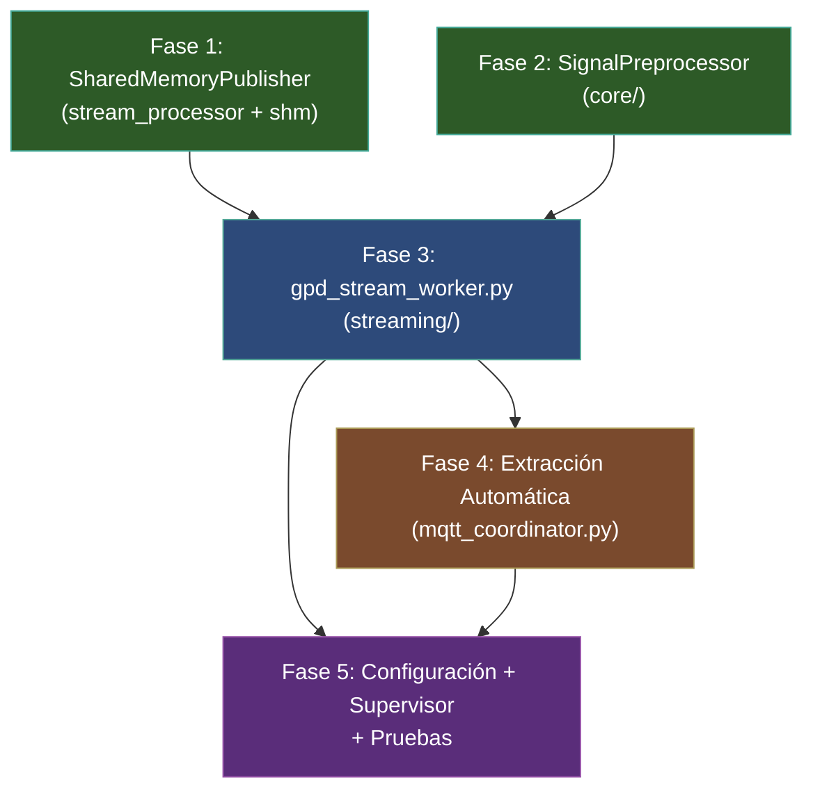
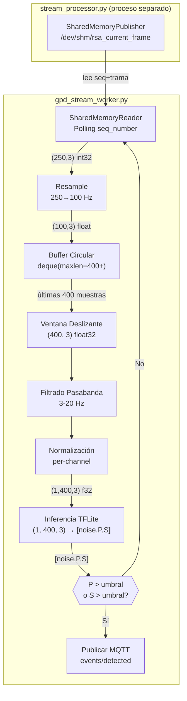
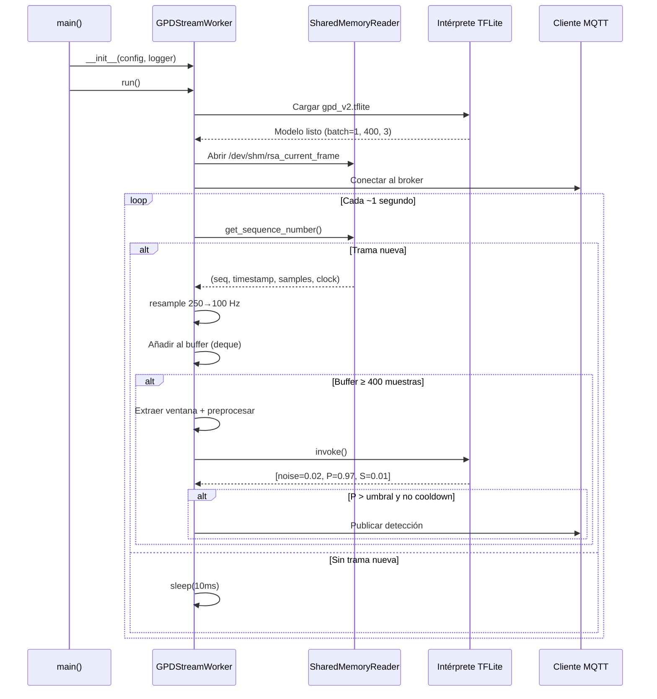
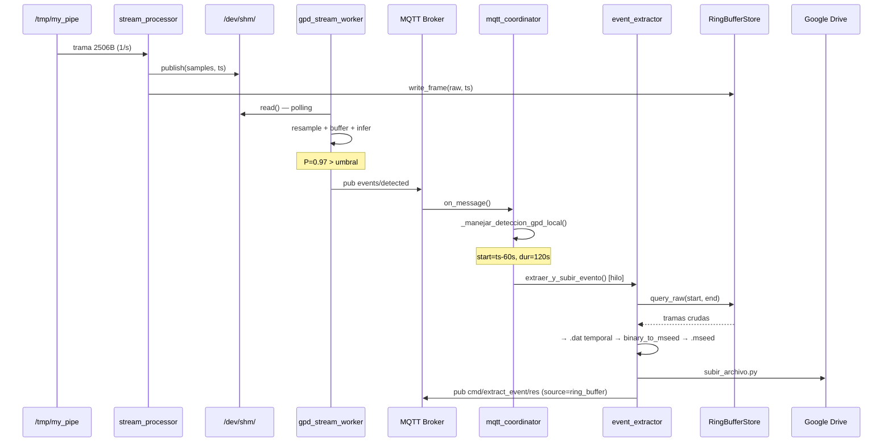
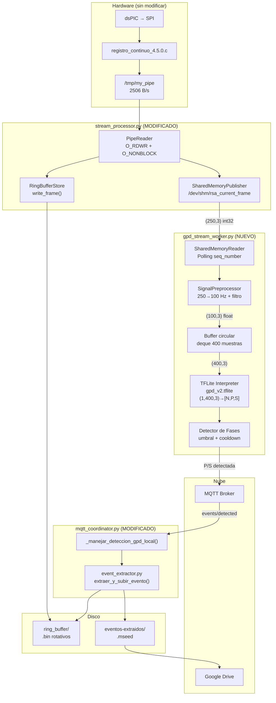

# Plan de Implementación: Inferencia GPD en Tiempo Real

> **Última revisión**: 2026-06-18 — Pendiente de confirmación de decisiones de diseño por el usuario.

> Sistema de detección sísmica automatizada mediante Machine Learning (Generalized Phase Detection) operando en tiempo real sobre el stream de datos del acelerógrafo RSA.

---

## Resumen Ejecutivo

Este plan implementa la funcionalidad **A** del blueprint general ([2026-06-16_sistema_streaming_tiempo_real_búfer_circular.md](file:///home/rsa/git/montajes/acelerografo-DEV00/local-RSA/2026-06-16_sistema_streaming_tiempo_real_búfer_circular.md)): inferencia GPD en tiempo real. El sistema consumirá el stream de datos del `stream_processor.py` (ya en producción), ejecutará el modelo TFLite sobre ventanas deslizantes de 4 segundos, y publicará detecciones de fases P/S vía MQTT para disparar la extracción automática de eventos.

### Alcance

| Incluido | Excluido (fases futuras) |
|----------|--------------------------|
| Publicación de tramas en memoria compartida (`/dev/shm/`) | Socket Unix para consumidores de streaming |
| Módulo de preprocesamiento de señal (downsampling + filtrado) | SeedLink feeder |
| Worker GPD con inferencia TFLite en ventanas deslizantes | Visualización local en tiempo real |
| Detección de fases P/S y publicación MQTT | Correlación regional multi-estación |
| Extracción automática de eventos por detección GPD | Reentrenamiento del modelo |
| Configuración, Supervisor y pruebas | Inferencia con modelo Keras (solo TFLite) |

### Prerrequisitos

| Componente | Estado | Ubicación |
|------------|--------|-----------|
| `frame_decoder.py` | ✅ Producción | `scripts/operation/core/` |
| `ring_buffer_store.py` | ✅ Producción | `scripts/operation/streaming/` |
| `stream_processor.py` | ✅ Producción | `scripts/operation/streaming/` |
| `event_extractor.py` (con ring buffer) | ✅ Producción | `scripts/operation/mqtt/` |
| Modelo TFLite `gpd_v2.tflite` | ✅ Disponible | `models/tflite/` (a copiar) |
| `tflite-runtime` en requirements.txt | ✅ Ya incluido | `requirements.txt` |

---

## Estructura de Archivos Resultante

```
scripts/operation/
├── core/
│   ├── __init__.py                    ✅ (sin cambios)
│   ├── frame_decoder.py              ✅ (sin cambios)
│   └── signal_preprocessor.py        [NUEVO] Fase 2 — Preprocesamiento de señal
├── streaming/
│   ├── __init__.py                    ✅ (sin cambios)
│   ├── ring_buffer_store.py           ✅ (sin cambios)
│   ├── stream_processor.py           [MODIFICADO] Fase 1 — Añadir publicación shm
│   ├── shared_memory_publisher.py    [NUEVO] Fase 1 — Gestión de /dev/shm/
│   └── gpd_stream_worker.py          [NUEVO] Fase 3 — Worker de inferencia
├── mqtt/
│   ├── mqtt_coordinator.py           [MODIFICADO] Fase 4 — Handler de detección GPD
│   └── event_extractor.py            ✅ (sin cambios)
└── structured_logger.py              [MODIFICADO] Fase 5 — Nuevos métodos de logging

configuration/
├── configuracion_dispositivo.json.template  [MODIFICADO] Fase 5 — Sección gpd
└── configuracion_mqtt.json.template         [MODIFICADO] Fase 4 — Tópicos GPD

models/
└── tflite/
    └── gpd_v2.tflite                 [NUEVO] Copiar desde repositorio GPD

scripts/task/
└── gpd_worker.conf                   [NUEVO] Fase 5 — Servicio Supervisor
```

---

## Diagrama de Dependencias entre Fases



> [!NOTE]
> Las fases 1 y 2 son independientes entre sí y pueden implementarse en paralelo. La fase 3 depende de ambas. Las fases 4 y 5 dependen de la fase 3.

---

## Fase 1: Publicador de Memoria Compartida

> **Objetivo**: Extender el `stream_processor.py` existente para que publique cada trama decodificada en un segmento de memoria compartida (`/dev/shm/`), habilitando la comunicación de ultra-baja latencia con consumidores locales como el worker GPD.

### Archivo nuevo: [streaming/shared_memory_publisher.py](file:///home/rsa/git/montajes/acelerografo-DEV00/scripts/operation/streaming/shared_memory_publisher.py)

**Dependencias**: `mmap`, `struct`, `os`, `numpy`, `core.frame_decoder`.

**Diseño del segmento de memoria compartida**:

El archivo `/dev/shm/rsa_current_frame` contiene la trama decodificada más reciente con un layout binario fijo:

```
Offset  Tamaño    Campo                     Tipo
──────  ────────  ────────────────────────  ──────────────
0       8         sequence_number           uint64 LE
8       8         timestamp_epoch           float64 LE (Unix timestamp)
16      3000      samples                   int32 LE × 750 (250×3)
3016    1         clock_source              uint8
3017    7         _padding                  reserved (alineamiento a 8 bytes)
──────  ────────
Total:  3024 bytes
```

> [!IMPORTANT]
> **¿Por qué `sequence_number`?** Los consumidores usan este contador monotónicamente creciente para detectar si hay una trama nueva sin necesidad de locks ni sincronización costosa. El consumidor guarda el último `seq` leído y, al ver un valor diferente, sabe que hay datos nuevos. Las lecturas y escrituras de `uint64` alineados a 8 bytes son atómicas en arquitecturas ARM de 64 bits. En la RPi 3B+ (ARMv8 de 32 bits), se usa un mecanismo de doble-lectura para garantizar coherencia.

**API pública**:

```python
import mmap
import struct
import numpy as np

# Constantes del layout
SHM_PATH = "/dev/shm/rsa_current_frame"
SHM_SIZE = 3024
OFFSET_SEQ = 0
OFFSET_TIMESTAMP = 8
OFFSET_SAMPLES = 16
OFFSET_CLOCK = 3016

class SharedMemoryPublisher:
    """
    Publica tramas decodificadas a un segmento de memoria compartida.
    
    El segmento vive en /dev/shm/ (tmpfs en Linux), proporcionando
    latencia de escritura < 1 µs sin I/O de disco.
    
    Thread-safe: una única instancia escribe; múltiples consumidores leen.
    La coherencia se garantiza mediante el sequence_number atómico.
    """
    
    def __init__(self, shm_path: str = SHM_PATH, logger=None):
        """
        Crea o abre el segmento de memoria compartida.
        
        Args:
            shm_path: Ruta en /dev/shm/ para el archivo mmap.
            logger:   Logger opcional.
        """
    
    def publish(self, samples: np.ndarray, timestamp: float, clock_source: int) -> None:
        """
        Escribe una trama decodificada al segmento de memoria compartida.
        
        Secuencia de escritura (para coherencia sin locks):
        1. Incrementar sequence_number
        2. Escribir timestamp_epoch
        3. Escribir samples (750 int32)
        4. Escribir clock_source
        
        Args:
            samples:       ndarray (250, 3) int32 — muestras decodificadas.
            timestamp:     Unix timestamp (float) de la trama.
            clock_source:  Fuente de reloj (0-5).
        """
    
    def close(self) -> None:
        """Cierra el mmap y elimina el archivo de /dev/shm/."""
    
    @property
    def sequence_number(self) -> int:
        """Retorna el sequence_number actual (útil para diagnóstico)."""
```

**Clase complementaria para consumidores** (en el mismo archivo):

```python
class SharedMemoryReader:
    """
    Lee tramas desde el segmento de memoria compartida (lado consumidor).
    
    Diseñado para polling de bajo consumo: el consumidor comprueba
    el sequence_number periódicamente y solo procesa cuando cambia.
    """
    
    def __init__(self, shm_path: str = SHM_PATH):
        """Abre el segmento existente en modo solo lectura."""
    
    def read(self) -> tuple[int, float, np.ndarray, int]:
        """
        Lee la trama actual de la memoria compartida.
        
        Returns:
            (sequence_number, timestamp_epoch, samples_250x3_int32, clock_source)
        """
    
    def get_sequence_number(self) -> int:
        """Lee solo el sequence_number (8 bytes) — operación ultra-rápida."""
    
    def close(self) -> None:
        """Cierra el mmap (no elimina el archivo)."""
```

### Archivo modificado: [streaming/stream_processor.py](file:///home/rsa/git/montajes/acelerografo-DEV00/scripts/operation/streaming/stream_processor.py)

**Cambios requeridos**:

```diff
+from streaming.shared_memory_publisher import SharedMemoryPublisher
+from core.frame_decoder import decode_frame
 
 class StreamProcessor:
     def __init__(self, ...):
         ...
+        self._shm_publisher: Optional[SharedMemoryPublisher] = None
+        self._shm_habilitado: bool = shm_habilitado  # Nuevo parámetro
 
     def run(self) -> None:
         ...
+        if self._shm_habilitado and not self._dry_run:
+            self._shm_publisher = SharedMemoryPublisher(logger=self._logger)
+            self._logger.info("[SHM_INIT] Publicador de memoria compartida iniciado.")
         ...
 
     def _procesar_trama(self, raw_frame: bytes) -> None:
         ...
         # Después de escribir al ring buffer exitosamente:
+        if self._shm_publisher is not None:
+            try:
+                frame_data = decode_frame(raw_frame, usar_fecha_filename=False)
+                self._shm_publisher.publish(
+                    samples=frame_data.samples,
+                    timestamp=frame_data.timestamp.timestamp(),
+                    clock_source=frame_data.clock_source,
+                )
+            except Exception as e:
+                self._logger.warning(f"[SHM_PUBLISH_ERROR] {e}")
 
     def _cerrar_recursos(self) -> None:
         ...
+        if self._shm_publisher is not None:
+            self._shm_publisher.close()
+            self._logger.info("[SHM_CLOSE] Publicador de memoria compartida cerrado.")
```

> [!WARNING]
> La llamada a `decode_frame()` dentro de `_procesar_trama()` introduce una decodificación adicional que antes no se hacía (el ring buffer almacena bytes crudos). En la RPi 3B+, `decode_frame()` tarda < 0.5 ms por trama, lo cual es despreciable frente al intervalo de 1 segundo entre tramas. Sin embargo, si el rendimiento es una preocupación, se puede cachear el resultado o decodificar condicionalmente solo si `_shm_publisher` no es None.

### Criterios de Aceptación — Fase 1

- [ ] El archivo `/dev/shm/rsa_current_frame` se crea al arrancar `stream_processor` con shm habilitado
- [ ] El `sequence_number` se incrementa monotónicamente con cada trama publicada
- [ ] `SharedMemoryReader.read()` recupera correctamente `(seq, timestamp, samples, clock_source)`
- [ ] Las muestras leídas desde shm son idénticas a las del `decode_frame()` correspondiente
- [ ] El segmento se limpia (`unlink`) al cierre limpio del daemon (SIGTERM)
- [ ] Si `stream_processor` arranca sin consumidores, la publicación a shm no falla ni ralentiza
- [ ] Tests unitarios: escritura/lectura de trama con datos conocidos, coherencia del sequence_number
- [ ] Si shm está deshabilitado en configuración, no se crea el archivo ni se intenta publicar
- [ ] El overhead de CPU adicional por la decodificación + escritura shm es < 1% en la RPi

---

## Fase 2: Módulo de Preprocesamiento de Señal

> **Objetivo**: Crear un módulo compartido para el preprocesamiento requerido por GPD: downsampling de 250 Hz a 100 Hz, normalización y filtrado pasabanda opcional.

### Archivo nuevo: [core/signal_preprocessor.py](file:///home/rsa/git/montajes/acelerografo-DEV00/scripts/operation/core/signal_preprocessor.py)

**Dependencias**: `numpy`, `scipy.signal`.

**Contexto del modelo GPD**:

| Parámetro | Valor | Fuente |
|-----------|-------|--------|
| Frecuencia de entrada | 100 Hz | Todos los scripts de inferencia GPD |
| Ventana de entrada | 400 muestras (4 s) | `n_feat = 2 * n_win`, `half_dur = 2.0`, `only_dt = 0.01` |
| Forma del tensor | `(batch, 400, 3)` float32 | `interpreter.resize_tensor_input(inp["index"], [batch_size, 400, 3])` |
| Normalización | Por ventana: `x / (max(abs(x)) + 1e-9)` | `max_vals = np.max(np.abs(tr_win), axis=1, keepdims=True) + 1e-9` |
| Filtrado | Pasabanda 3-20 Hz (batch) o 1-45 Hz (genérico) | Variable según script |
| Stride de inferencia | 10 muestras a 100 Hz = 0.1 s (batch) / 100 muestras = 1 s (streaming) | `n_shift = 10` en batch; 1 trama/s en streaming |

> [!IMPORTANT]
> **Decisión de diseño — Downsampling**: Los datos crudos del acelerógrafo llegan a 250 Hz. El modelo GPD espera 100 Hz. La razón 250/100 = 2.5:1 **no es un entero**, lo que impide usar `scipy.signal.decimate` directamente. Se usará `scipy.signal.resample_poly` (polifásico, más eficiente que FFT) con factores `up=2, down=5`, produciendo exactamente 100 muestras por trama de 250.

**API pública**:

```python
import numpy as np
from typing import Optional

# Constantes del modelo GPD
GPD_SAMPLE_RATE = 100      # Hz — frecuencia esperada por el modelo
GPD_WINDOW_SAMPLES = 400   # 4 segundos a 100 Hz
GPD_AXES = 3               # Canales: N, E, Z
RAW_SAMPLE_RATE = 250      # Hz — frecuencia del acelerógrafo

class SignalPreprocessor:
    """
    Preprocesador de señal para el pipeline GPD en tiempo real.
    
    Encapsula las operaciones de downsampling, filtrado y normalización
    requeridas para transformar los datos crudos del acelerógrafo (250 Hz,
    int32) al formato de entrada del modelo GPD (100 Hz, float32, normalizado).
    
    Se instancia una vez y se reutiliza en el bucle de inferencia.
    """
    
    def __init__(
        self,
        raw_sample_rate: int = RAW_SAMPLE_RATE,
        target_sample_rate: int = GPD_SAMPLE_RATE,
        filter_enabled: bool = True,
        freq_min: float = 3.0,
        freq_max: float = 20.0,
        filter_order: int = 4,
    ):
        """
        Args:
            raw_sample_rate:    Frecuencia de muestreo de entrada (Hz).
            target_sample_rate: Frecuencia de muestreo de salida (Hz).
            filter_enabled:     Si True, aplica filtro pasabanda.
            freq_min:           Frecuencia mínima del pasabanda (Hz).
            freq_max:           Frecuencia máxima del pasabanda (Hz).
            filter_order:       Orden del filtro Butterworth.
        """
    
    def resample_frame(self, samples: np.ndarray) -> np.ndarray:
        """
        Resamplea una trama de 250 muestras a 100 muestras por eje.
        
        Usa scipy.signal.resample_poly con factor up=2, down=5
        (250 * 2/5 = 100).
        
        Args:
            samples: ndarray (250, 3) int32 — una trama cruda decodificada.
            
        Returns:
            ndarray (100, 3) float64 — muestras resampleadas.
        """
    
    def apply_filter(self, data: np.ndarray) -> np.ndarray:
        """
        Aplica filtro pasabanda Butterworth al buffer completo.
        
        Se aplica por eje (columna) sobre una ventana acumulada,
        no sobre tramas individuales, para evitar artefactos de borde.
        
        Args:
            data: ndarray (N, 3) float — buffer de datos continuos a 100 Hz.
            
        Returns:
            ndarray (N, 3) float — datos filtrados.
        """
    
    def normalize_window(self, window: np.ndarray) -> np.ndarray:
        """
        Normaliza una ventana de datos para inferencia GPD.
        
        Normalización per-channel: divide cada canal por su valor
        absoluto máximo + epsilon para evitar divisiones por cero.
        
        Equivalente a la normalización del script de referencia:
            max_vals = np.max(np.abs(data), axis=0, keepdims=True) + 1e-9
            data = data / max_vals
        
        Args:
            window: ndarray (400, 3) float — ventana a normalizar.
            
        Returns:
            ndarray (400, 3) float32 — ventana normalizada lista para inferencia.
        """
    
    def prepare_window(self, window_raw_100hz: np.ndarray) -> np.ndarray:
        """
        Pipeline completo: filtrado + normalización sobre una ventana.
        
        Args:
            window_raw_100hz: ndarray (400, 3) float — ventana a 100 Hz sin filtrar.
            
        Returns:
            ndarray (1, 400, 3) float32 — tensor listo para inferencia TFLite.
                Nota: se añade la dimensión de batch (eje 0).
        """
```

### Criterios de Aceptación — Fase 2

- [ ] `resample_frame()` transforma `(250, 3) int32` → `(100, 3) float` correctamente
- [ ] El downsampling preserva las frecuencias por debajo de Nyquist (50 Hz a 100 Hz): señal sintética de 10 Hz no se atenúa significativamente
- [ ] `normalize_window()` produce salida con `max(abs(x)) ≈ 1.0` por canal
- [ ] `normalize_window()` no falla con ventana de ceros (silencio total)
- [ ] `apply_filter()` atenúa frecuencias fuera del rango `[freq_min, freq_max]`
- [ ] `prepare_window()` retorna shape `(1, 400, 3)` dtype `float32`
- [ ] Sin dependencia de ObsPy (solo numpy + scipy.signal)
- [ ] Tests unitarios con señales sintéticas (sinusoide pura, ruido blanco, ventana de ceros)
- [ ] Rendimiento: `prepare_window()` se ejecuta en < 5 ms en la RPi 3B+

---

## Fase 3: Worker de Inferencia GPD

> **Objetivo**: Crear el daemon consumidor que lee tramas desde la memoria compartida, acumula ventanas deslizantes de 4 segundos, ejecuta inferencia TFLite y publica detecciones vía MQTT.

### Archivo nuevo: [streaming/gpd_stream_worker.py](file:///home/rsa/git/montajes/acelerografo-DEV00/scripts/operation/streaming/gpd_stream_worker.py)

**Dependencias**: `tflite_runtime.interpreter.Interpreter`, `numpy`, `paho.mqtt.client`, `shared_memory_publisher.SharedMemoryReader`, `core.signal_preprocessor.SignalPreprocessor`, `json`, `os`, `signal`, `time`, `logging`, `collections.deque`.

**Diseño del pipeline en streaming**:



**Lógica del stride**:

| Parámetro | Valor | Explicación |
|-----------|-------|-------------|
| Ventana GPD | 400 muestras a 100 Hz = 4 s | Input fijo del modelo |
| Stride de inferencia | 100 muestras a 100 Hz = 1 s | Cada nueva trama (1 s de datos crudos = 100 muestras a 100 Hz) |
| Buffer circular | ≥ 400 muestras a 100 Hz | `deque(maxlen=N)` — se llena con las primeras 4 tramas, luego se desliza |
| Latencia | ~4 s (acumulación inicial) + ~50 ms (inferencia) | Primera detección posible a los 4 segundos del arranque |

> [!NOTE]
> **Diferencia con el script batch**: El script [gpd_tflite_inference_chunked.py](file:///home/rsa/git/institucional/generalized-phase-detection/scripts/inference/chunked/gpd_tflite_inference_chunked.py) usa `n_shift = 10` (stride de 10 muestras = 0.1 s) y batches de 100 ventanas. En streaming, usar un stride de 0.1 s generaría 10 inferencias por segundo, lo cual es excesivo para una RPi. Proponemos un **stride de 1 segundo** (100 muestras a 100 Hz), que coincide con la llegada de cada trama del pipe, resultando en 1 inferencia/segundo. Esto es suficiente para detección sísmica (los terremotos duran > 1 s).

**API del Worker**:

```python
import numpy as np
from collections import deque
from typing import Optional
from tflite_runtime.interpreter import Interpreter

class GPDStreamWorker:
    """
    Worker de inferencia GPD en tiempo real.
    
    Lee tramas decodificadas desde la memoria compartida, acumula un buffer
    deslizante de 4 segundos y ejecuta inferencia TFLite con un stride de
    1 segundo. Publica detecciones de fases P/S vía MQTT.
    
    Diseñado para ejecutarse como servicio Supervisor en la RPi.
    """
    
    def __init__(self, config: dict, logger):
        """
        Args:
            config: Sección 'gpd' de configuracion_dispositivo.json.
            logger: Logger del proceso.
        
        Inicializa:
            - SharedMemoryReader para leer del shm
            - SignalPreprocessor para resample + filtrado + normalización
            - Intérprete TFLite con batch_size=1
            - Cliente MQTT para publicar detecciones
            - Buffer circular (deque) de 100 Hz
        """
        self._model_path: str        # Ruta al modelo .tflite
        self._umbral_p: float        # Umbral de probabilidad para fase P
        self._umbral_s: float        # Umbral de probabilidad para fase S
        self._ventana_pre_s: int     # Segundos pre-evento para extracción
        self._ventana_post_s: int    # Segundos post-evento para extracción
        self._cooldown_s: float      # Segundos mínimos entre detecciones (anti-spam)
        
        self._buffer: deque          # Buffer circular a 100 Hz: (100,3) por trama
        self._running: bool = False
        self._last_detection_time: float = 0.0  # Timestamp última detección
        
        # Estadísticas
        self.inferencias_total: int = 0
        self.detecciones_p: int = 0
        self.detecciones_s: int = 0
    
    def run(self) -> None:
        """
        Bucle principal del worker:
        
        1. Registrar señales SIGTERM/SIGINT.
        2. Cargar modelo TFLite.
        3. Iniciar SharedMemoryReader.
        4. Conectar cliente MQTT.
        5. Bucle:
            a. Leer seq_number del shm.
            b. Si hay trama nueva:
                i.   Leer trama completa.
                ii.  Resamplear 250 → 100 Hz.
                iii. Añadir al buffer circular.
                iv.  Si el buffer tiene ≥ 400 muestras:
                     - Extraer ventana (400, 3).
                     - Preprocesar (filtrar + normalizar).
                     - Ejecutar inferencia TFLite.
                     - Si P > umbral_p o S > umbral_s y no en cooldown:
                       → publicar detección MQTT.
            c. Si no hay trama nueva: sleep(10 ms).
        """
    
    def stop(self) -> None:
        """Solicita la detención ordenada del worker."""
    
    def _cargar_modelo(self) -> None:
        """
        Carga el intérprete TFLite con batch_size=1.
        
        Configura:
            interpreter.resize_tensor_input(inp["index"], [1, 400, 3])
            interpreter.allocate_tensors()
        """
    
    def _ejecutar_inferencia(self, ventana: np.ndarray) -> np.ndarray:
        """
        Ejecuta inferencia TFLite sobre una ventana preprocesada.
        
        Args:
            ventana: ndarray (1, 400, 3) float32
            
        Returns:
            ndarray (1, 3) float32 — probabilidades [noise, P, S]
        """
    
    def _evaluar_deteccion(self, probabilidades: np.ndarray, timestamp: float) -> Optional[dict]:
        """
        Evalúa si las probabilidades superan los umbrales y no estamos en cooldown.
        
        Args:
            probabilidades: ndarray (3,) — [noise, P, S]
            timestamp:      Timestamp UTC de la ventana central.
            
        Returns:
            dict con la detección si se supera umbral, o None.
            Formato:
            {
                "type": "P" | "S",
                "probability": float,
                "timestamp": "ISO8601",
                "window_start": "ISO8601",
                "window_end": "ISO8601",
            }
        """
    
    def _publicar_deteccion(self, deteccion: dict) -> None:
        """
        Publica la detección en el tópico MQTT events/detected.
        
        Payload MQTT:
        {
            "type": "P",
            "probability": 0.97,
            "timestamp": "2026-06-18T21:30:45.000Z",
            "window_start": "2026-06-18T21:30:43.000Z",
            "window_end": "2026-06-18T21:30:47.000Z",
            "station_id": "DEV00",
            "model": "gpd_v2.tflite",
            "source": "streaming"
        }
        """
```

### Mecanismo Anti-Spam (Cooldown)

Los terremotos generan múltiples ventanas consecutivas con probabilidad alta. Sin un mecanismo de anti-spam, el worker publicaría decenas de detecciones por evento. Se implementa un **cooldown configurable** (por defecto: 30 segundos):

```
Evento sísmico (10 s de duración):
  t=0s  P=0.98 → ¡PUBLICAR! (primera detección)
  t=1s  P=0.95 → cooldown activo, ignorar
  t=2s  P=0.92 → cooldown activo, ignorar
  ...
  t=10s P=0.30 → no supera umbral
  ...
  t=31s P=0.01 → cooldown expirado, pero no supera umbral
```

### Flujo de arranque del Worker



### Criterios de Aceptación — Fase 3

- [ ] El worker arranca y se conecta exitosamente al shm y al broker MQTT
- [ ] Si el shm no existe (stream_processor no corre), el worker espera sin crash y reintenta
- [ ] La inferencia TFLite produce salida `(1, 3)` con probabilidades en rango `[0, 1]`
- [ ] Con señal de ruido puro (datos aleatorios), no se generan detecciones espurias (falsos positivos)
- [ ] Con datos sintéticos que simulan una onda P (pulso + ruido), la probabilidad P supera el umbral
- [ ] El cooldown previene publicaciones múltiples dentro de la ventana configurada
- [ ] El worker reporta estadísticas cada N inferencias: total, detecciones P, detecciones S
- [ ] Cierre limpio con SIGTERM: desconexión MQTT, cierre del shm
- [ ] Latencia total desde escritura al pipe hasta publicación MQTT ≤ 5 s (dominada por acumulación del buffer)
- [ ] Consumo de CPU en la RPi 3B+ estable en < 15% (inferencia TFLite con 2 threads)
- [ ] Consumo de RAM estable (sin memory leaks en el bucle de inferencia)
- [ ] Tests unitarios: pipeline completo con datos sintéticos, cooldown, arranque/parada

---

## Fase 4: Extracción Automática por Detección GPD

> **Objetivo**: Modificar el coordinador MQTT para que, al recibir una detección GPD local, dispare automáticamente la extracción del evento desde el ring buffer.

### Archivo modificado: [mqtt/mqtt_coordinator.py](file:///home/rsa/git/montajes/acelerografo-DEV00/scripts/operation/mqtt/mqtt_coordinator.py)

**Cambios requeridos**:

1. **Nuevo handler en `CommandDispatcher`** — No. La detección GPD no es un "comando", es un **evento local publicado por otro proceso**. Se maneja en `on_message()` al detectar el tópico de detección propio.

2. **Nuevo flujo en `on_message()`**:

```diff
 def on_message(client, userdata, msg):
     ...
     if "/cmd/" in topic:
         # (flujo existente de comandos)
         ...
     elif "/events/detected" in topic and config["id"] not in topic:
         # Evento de otra estación (correlación regional) — existente
         ...
+    elif "/events/detected" in topic and config["id"] in topic:
+        # ¡Detección GPD local! Disparar extracción automática
+        _manejar_deteccion_gpd_local(client, userdata, payload)
     elif "/config/set" in topic:
         ...
```

3. **Nueva función de manejo**:

```python
def _manejar_deteccion_gpd_local(client, userdata, payload: dict) -> None:
    """
    Maneja una detección GPD local publicada por gpd_stream_worker.

    Flujo:
    1. Validar el payload (tipo, timestamp, probabilidad).
    2. Calcular el rango de extracción:
        start = timestamp - ventana_pre_evento_s
        duration = ventana_pre_evento_s + ventana_post_evento_s
    3. Invocar extraer_y_subir_evento() en un hilo separado
       (igual que _cmd_extract_event).
    4. Publicar resultado en cmd/extract_event/res con
       request_id = "gpd-auto-{timestamp}".

    Payload de entrada esperado:
    {
        "type": "P",
        "probability": 0.97,
        "timestamp": "2026-06-18T21:30:45.000Z",
        "station_id": "DEV00",
        "model": "gpd_v2.tflite",
        "source": "streaming"
    }
    """
```

4. **Configuración de ventanas de extracción**:

Las ventanas pre y post evento se leen de la configuración:
```json
{
    "gpd": {
        "ventana_pre_evento_s": 60,
        "ventana_post_evento_s": 60,
        "auto_extract": true,
        "auto_upload": true
    }
}
```

Con `ventana_pre_evento_s = 60` y `ventana_post_evento_s = 60`, una detección a las 21:30:45 generará:
- `start = 21:29:45` (60 s antes)
- `duration = 120 s` (60 + 60)
- Archivo resultante: ~120 s de datos miniSEED

### Flujo completo de detección → extracción



### Archivo modificado: [configuration/configuracion_mqtt.json.template](file:///home/rsa/git/montajes/acelerografo-DEV00/configuration/configuracion_mqtt.json.template)

Añadir suscripción a detecciones propias para el flujo automático:

```diff
     "subscriptions": [
         "events_regional",
         "cmd_execute",
         "cmd_broadcast",
-        "config_set"
+        "config_set",
+        "events_local"
     ],
```

> [!NOTE]
> El coordinador MQTT ya se suscribe a `events_regional` (wildcard `+/events/detected`), que incluye las detecciones propias. Sin embargo, el filtro actual en `on_message()` **excluye** las detecciones propias (`config["id"] not in topic`). El cambio de la Fase 4 añade una rama que **captura** las detecciones propias.

### Criterios de Aceptación — Fase 4

- [ ] Al recibir una detección GPD local, el coordinador dispara automáticamente `extraer_y_subir_evento()`
- [ ] La extracción usa las ventanas pre/post configurables (default: 60 s + 60 s)
- [ ] La respuesta MQTT incluye `request_id` con prefijo `"gpd-auto-"` para trazabilidad
- [ ] Si `auto_extract` está deshabilitado en configuración, la detección se loguea pero no se extrae
- [ ] Si `auto_upload` está deshabilitado, la extracción se genera localmente sin subir a Drive
- [ ] No se bloquea el loop MQTT durante la extracción (hilo separado, igual que `extract_event` manual)
- [ ] Múltiples detecciones dentro del cooldown del coordinador no generan extracciones duplicadas
- [ ] El payload de detección inválido (sin timestamp, sin type) se rechaza con log warning
- [ ] Tests: simulación de detección GPD → verificar que se invoca `extraer_y_subir_evento()` con los parámetros correctos

---

## Fase 5: Configuración, Supervisor y Pruebas de Integración

### Modificación: [configuracion_dispositivo.json.template](file:///home/rsa/git/montajes/acelerografo-DEV00/configuration/configuracion_dispositivo.json.template)

Agregar sección `gpd` y `shared_memory` dentro de `streaming`:

```diff
     "streaming": {
         "habilitado": true,
         "ring_buffer": {
             "directorio": "/home/rsa/data/ring-buffer/",
             "max_size_mb": 500,
             "archivo_duracion_min": 5
-        }
+        },
+        "shared_memory": {
+            "habilitado": true,
+            "ruta": "/dev/shm/rsa_current_frame"
+        },
+        "gpd": {
+            "habilitado": true,
+            "modelo_ruta": "models/tflite/gpd_v2.tflite",
+            "umbral_p": 0.95,
+            "umbral_s": 0.95,
+            "cooldown_s": 30,
+            "ventana_pre_evento_s": 60,
+            "ventana_post_evento_s": 60,
+            "auto_extract": true,
+            "auto_upload": true,
+            "filtro": {
+                "habilitado": true,
+                "freq_min_hz": 3.0,
+                "freq_max_hz": 20.0
+            }
+        }
     }
```

### Archivo nuevo: [scripts/task/gpd_worker.conf](file:///home/rsa/git/montajes/acelerografo-DEV00/scripts/task/gpd_worker.conf)

Configuración de Supervisor para el worker GPD:

```ini
[program:gpd_worker]
command={{PROJECT_LOCAL_ROOT}}/.venv/bin/python3 {{PROJECT_LOCAL_ROOT}}/scripts/streaming/gpd_stream_worker.py
directory={{PROJECT_LOCAL_ROOT}}/scripts/streaming/
environment=PROJECT_LOCAL_ROOT="{{PROJECT_LOCAL_ROOT}}"
autostart=true
autorestart=true
startretries=3
startsecs=10
user=rsa
stdout_logfile={{PROJECT_LOCAL_ROOT}}/log-files/supervisor_gpd_worker.log
stderr_logfile={{PROJECT_LOCAL_ROOT}}/log-files/supervisor_gpd_worker.err
```

> [!NOTE]
> **`startsecs=10`**: El worker GPD necesita ~5-8 s para cargar el modelo TFLite en la RPi 3B+. Se usa `startsecs=10` para que Supervisor no lo considere crasheado durante la carga inicial.

### Modificación: [scripts/setup/update.sh](file:///home/rsa/git/montajes/acelerografo-DEV00/scripts/setup/update.sh)

Agregar bloque para el servicio `gpd_worker` en la función `update_supervisor_config`:

```diff
+    # --- gpd_worker ---
+    local src_gpd="$PROJECT_GIT_ROOT/scripts/task/gpd_worker.conf"
+    local temp_gpd="$PROJECT_LOCAL_ROOT/tmp-files/gpd_worker.conf.tmp"
+    local dest_gpd="/etc/supervisor/conf.d/gpd_worker.conf"
+
+    sed "s|{{PROJECT_LOCAL_ROOT}}|$PROJECT_LOCAL_ROOT|g" "$src_gpd" > "$temp_gpd"
+
+    if [ ! -f "$dest_gpd" ] || ! cmp -s "$temp_gpd" "$dest_gpd"; then
+        echo "Actualizando configuración de Supervisor: $dest_gpd"
+        sudo cp "$temp_gpd" "$dest_gpd"
+        sudo supervisorctl reread
+        sudo supervisorctl update
+    else
+        echo "No se detectaron cambios en la configuración de Supervisor (gpd_worker)."
+    fi
```

Agregar copia del modelo TFLite:

```diff
+# Copiar modelo TFLite para GPD
+mkdir -p "$PROJECT_LOCAL_ROOT/models/tflite"
+if [ -f "$PROJECT_GIT_ROOT/models/tflite/gpd_v2.tflite" ]; then
+    cp "$PROJECT_GIT_ROOT/models/tflite/gpd_v2.tflite" "$PROJECT_LOCAL_ROOT/models/tflite/"
+    echo "Modelo GPD TFLite copiado a producción."
+fi
```

### Modificación: [structured_logger.py](file:///home/rsa/git/montajes/acelerografo-DEV00/scripts/operation/structured_logger.py)

Agregar métodos específicos para GPD:

```python
# --- Métodos específicos para Inferencia GPD ---

def gpd_load(self, model_path: str, load_time_s: float):
    """[GPD_LOAD] Modelo TFLite cargado"""
    self._log_structured("SUMMARY", "GPD_LOAD", model_path, {"load_time": f"{load_time_s:.2f}s"})

def gpd_inference(self, prob_noise: float, prob_p: float, prob_s: float):
    """[GPD_INFERENCE] Resultado de inferencia (solo en DEBUG)"""
    self._log_structured("DEBUG", "GPD_INFERENCE", None, {
        "noise": f"{prob_noise:.3f}", "P": f"{prob_p:.3f}", "S": f"{prob_s:.3f}"
    })

def gpd_detection(self, phase_type: str, probability: float, timestamp: str):
    """[GPD_DETECTION] Fase sísmica detectada"""
    self._log_structured("SUMMARY", "GPD_DETECTION", phase_type, {
        "prob": f"{probability:.3f}", "timestamp": timestamp
    })

def gpd_cooldown(self, remaining_s: float):
    """[GPD_COOLDOWN] Detección ignorada por cooldown activo"""
    self._log_structured("DEBUG", "GPD_COOLDOWN", None, {"remaining_s": f"{remaining_s:.1f}"})

def gpd_error(self, operation: str, error: str):
    """[GPD_ERROR] Error en el pipeline GPD"""
    self._log_structured("SUMMARY", "GPD_ERROR", operation, {"error": error})
```

### Copia del Modelo TFLite

El modelo `gpd_v2.tflite` (~3.4 MB) debe copiarse desde el repositorio GPD al directorio del acelerógrafo:

```
Origen:  institucional/generalized-phase-detection/models/gpd_v2.tflite
Destino: montajes/acelerografo-DEV00/models/tflite/gpd_v2.tflite
```

> [!WARNING]
> **Restricción SSHFS**: La copia al dispositivo remoto debe realizarse manualmente por el usuario, no por el agente. El directorio `models/tflite/` en el repositorio del acelerógrafo sirve como almacén versionado del modelo.

### Pruebas

#### Tests Unitarios (ejecutables sin hardware)

| Test | Módulo | Descripción |
|------|--------|-------------|
| `test_shm_write_read` | `shared_memory_publisher` | Escritura y lectura de trama con datos conocidos |
| `test_shm_sequence` | `shared_memory_publisher` | Verificar que seq_number se incrementa monotónicamente |
| `test_shm_coherencia` | `shared_memory_publisher` | Escritura concurrente: reader siempre obtiene trama completa |
| `test_resample_250_to_100` | `signal_preprocessor` | Downsampling preserva señal < Nyquist |
| `test_resample_shape` | `signal_preprocessor` | (250,3) → (100,3) |
| `test_normalize_range` | `signal_preprocessor` | Salida normalizada con max ≈ 1.0 |
| `test_normalize_zeros` | `signal_preprocessor` | Ventana de ceros → no crash |
| `test_filter_attenuation` | `signal_preprocessor` | Señal fuera de banda atenuada |
| `test_prepare_window_shape` | `signal_preprocessor` | Salida: (1, 400, 3) float32 |
| `test_gpd_inference_shape` | `gpd_stream_worker` | TFLite produce (1, 3) |
| `test_gpd_cooldown` | `gpd_stream_worker` | No publica dentro del cooldown |
| `test_gpd_detection_format` | `gpd_stream_worker` | Payload MQTT contiene campos requeridos |
| `test_auto_extract_trigger` | `mqtt_coordinator` | Detección local dispara extracción |
| `test_auto_extract_disabled` | `mqtt_coordinator` | Con auto_extract=false, no se extrae |

#### Verificación en Hardware (manual, delegación al usuario)

> [!CAUTION]
> Recordar la **restricción SSHFS**: no ejecutar comandos autónomos en rutas bajo `montajes/**`. Los comandos se proporcionan al usuario para ejecución manual.

| Verificación | Comando sugerido |
|-------------|-----------------|
| Estado de shm | `ls -la /dev/shm/rsa_current_frame` |
| Worker corriendo | `sudo supervisorctl status gpd_worker` |
| Logs del worker | `tail -f $PROJECT_LOCAL_ROOT/log-files/supervisor_gpd_worker.log` |
| Uso de CPU | `top -p $(pgrep -f gpd_stream_worker)` |
| Prueba de detección | Publicar pulso sintético en el pipe (requiere herramienta ad-hoc) |
| Consumo de RAM | `ps -o rss= -p $(pgrep -f gpd_stream_worker) \| awk '{print $1/1024 " MB"}'` |
| Latencia E2E | Observar timestamps en log del worker vs timestamp de la trama del pipe |

---

## Diagrama de Arquitectura Completa



---

## Estimación de Esfuerzo

| Fase | Componente | Estimación |
|------|-----------|------------|
| 1 | `SharedMemoryPublisher` + modificación `stream_processor` + tests | ~1 sesión |
| 2 | `SignalPreprocessor` + tests | ~1 sesión |
| 3 | `gpd_stream_worker.py` + tests | ~2 sesiones |
| 4 | Integración MQTT para extracción automática | ~1 sesión |
| 5 | Configuración + Supervisor + update.sh + pruebas de integración | ~1 sesión |
| **Total** | | **~6 sesiones** |

---

## Decisiones Pendientes

> [!IMPORTANT]
> **1. Stride de inferencia en streaming**
>
> **Propuesta**: Stride de 1 segundo (= 1 inferencia por trama recibida), alineado con la tasa de datos del pipe. Esto reduce la carga de CPU a ~15% frente al stride de 0.1 s del script batch que generaría 10 inferencias/s (~100%+ CPU).
>
> **Alternativa**: Stride de 0.5 s (2 inferencias/s). Mayor sensibilidad temporal pero mayor consumo.
>
> ¿Está bien 1 inferencia por segundo, o prefieres mayor resolución?

> [!IMPORTANT]
> **2. Umbrales de detección para streaming**
>
> El script batch usa `min_proba = 0.95` para ambas fases. En streaming, los umbrales podrían ser diferentes:
> - Umbral alto (0.95): menos falsos positivos, riesgo de perder eventos pequeños.
> - Umbral medio (0.80): más detecciones, incluye más ruido.
>
> **Propuesta**: Iniciar con `umbral_p = 0.95` y `umbral_s = 0.95` (igual que batch), configurable desde JSON. ¿Correcto?

> [!IMPORTANT]
> **3. Duración del cooldown entre detecciones**
>
> **Propuesta**: 30 segundos. Un terremoto regional moderado dura ~5-15 s de señal fuerte. Con 30 s de cooldown, se captura una detección por evento y se evita spam.
>
> ¿30 s es adecuado, o prefieres un valor diferente?

> [!IMPORTANT]
> **4. Ventanas de extracción pre/post evento**
>
> **Propuesta**: 60 s antes + 60 s después de la detección = archivo de 120 s.
> 
> El ring buffer en disco retiene ~11 horas de datos, así que 60 s pre-evento siempre estarán disponibles. ¿Son suficientes 60+60, o necesitas más contexto?

> [!IMPORTANT]
> **5. ¿Filtrado pasabanda o no en streaming?**
>
> El script batch TFLite usa `filter_data = True` con pasabanda 3-20 Hz. Sin embargo, el filtrado sobre ventanas cortas (4 s) puede generar artefactos de borde. Opciones:
> - **A) Filtrar con padding**: Mantener un buffer de señal más largo (8-10 s) y filtrar antes de extraer la ventana de 4 s. Más correcto, más RAM.
> - **B) No filtrar en streaming**: El modelo podría ser suficientemente robusto sin filtrado previo. Más simple, menos consumo.
> - **C) Filtrado en buffer acumulado**: Filtrar el buffer completo cada vez (4+ s de datos). Compromiso de calidad/rendimiento.
>
> **Propuesta**: Opción A (filtrar con padding), usando un buffer de 8 s y extrayendo la ventana central de 4 s. ¿De acuerdo?

> [!IMPORTANT]
> **6. Ubicación del modelo TFLite en el repositorio del acelerógrafo**
>
> **Propuesta**: Crear `models/tflite/` en el repositorio `acelerografo-DEV00` y copiar `gpd_v2.tflite` desde `institucional/generalized-phase-detection/models/`. Esto desacopla el acelerógrafo del repositorio GPD.
>
> ¿Es correcta esta estrategia, o prefieres un symlink o una referencia al repo GPD?

---

## Riesgos y Mitigaciones

| Riesgo | Impacto | Mitigación |
|--------|---------|-----------|
| TFLite consume demasiada CPU en RPi 3B+ | Otros servicios se ralentizan | `num_threads=2` en TFLite; `nice` para bajar prioridad del worker |
| Inferencias espurias por ruido electrónico | Falsas alarmas → extracciones innecesarias | Umbral alto (0.95); cooldown de 30 s; filtro pasabanda |
| El shm no existe al arrancar gpd_worker | Worker crashea al inicio | Retry loop con backoff exponencial (esperar a que stream_processor arranque) |
| Memory leak en buffer de numpy | OOM killer mata el worker | `deque(maxlen=N)` limita el buffer; monitoreo de RSS en health metrics |
| Modelo TFLite incompatible con la versión de tflite-runtime | Fallo al cargar | Validar versión en arranque; incluir la versión del modelo en el log |
| Desincronización de timestamps shm ↔ ring buffer | Extracción con rango incorrecto | Usar siempre UTC epoch; validar coherencia con timestamp del ring buffer |
